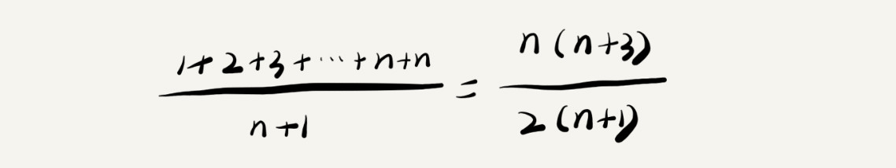

# 复杂度分析（下）- 打卡

本次要学习：**最好情况时间复杂度**（best case time complexity）、**最坏情况时间复杂度**（worst case time complexity）、**平均情况时间复杂度**（average case time complexity）、**均摊时间复杂度**（amortized time complexity）四个复杂度分析知识。

### 1、最好情况时间复杂度

*理解：最好情况时间复杂度就是，在最理想的情况下，执行这段代码的时间复杂度*

```java
// n表示数组array的长度
int find(int[] array, int n, int x) {
  int i = 0;
  int pos = -1;
  for (; i < n; ++i) {
    if (array[i] == x) {
       pos = i;
       break;
    }
  }
  return pos;
}
```

上面这段代码，最好的情况是**if(array[i] == x)**在第一次就找到了，所以，只执行一遍，这样最好的时间复杂度是O(1)


### 2、最坏情况时间复杂度

*理解:最坏情况时间复杂度就是，在最糟糕的情况下，执行这段代码的时间复杂度*

代码示例如上,如果x没有在第一次执行时就被找到，最坏的情况是array数组里没有x这个值，那for循环要执行n次，那他的时间复杂度就是O(n)了

### 3、平均情况时间复杂度

在数组中查找x值有n+1种情况：**在数组的 0～n-1 位置中和不在数组中**

思路：我们把每种情况下，查找需要遍历的元素个数累加起来，然后再除以 n+1，就可以得到需要遍历的元素个数的平均值，即：



但这个思路还是有点问题，就是没有将各种情况发生的概率考虑进去，如果考虑进去的话，得到：


这个值就是概率论中的**加权平均值**，也叫作**期望值**，所以平均时间复杂度的全称应该叫**加权平均时间复杂度**或者**期望时间复杂度**。

**时间复杂度的大 O标记法中，可以省略掉系数、低阶、常量，所以，咱们把刚刚这个公式简化之后，得到的平均时间复杂度就是 O(n)**

### 4、均摊时间复杂度

针对O(1),O(n),O(1),O(n),O(1),O(n),....这种循环往复出现的特殊情况，使用**摊还分析**，得到的复杂度叫**摊还时间复杂度**

```java
 // array表示一个长度为n的数组
 // 代码中的array.length就等于n
 int[] array = new int[n];
 int count = 0;
 
 void insert(int val) {
    if (count == array.length) {
       int sum = 0;
       for (int i = 0; i < array.length; ++i) {
          sum = sum + array[i];
       }
       array[0] = sum;
       count = 1;
    }

    array[count] = val;
    ++count;
 }
```

**解释**：这段代码实现了一个往数组中插入数据的功能。当数组满了之后，也就是代码中的 count == array.length 时，我们用 for 循环遍历数组求和，并清空数组，将求和之后的 sum 值放到数组的第一个位置，然后再将新的数据插入。但如果数组一开始就有空闲空间，则直接将数据插入数组。

**应用场景**：对一个数据结构进行一组连续操作中，大部分情况下时间复杂度都很低，只有个别情况下时间复杂度比较高，而且这些操作之间存在前后连贯的时序关系，这个时候，我们就可以将这一组操作放在一块儿分析，看是否能将较高时间复杂度那次操作的耗时，平摊到其他那些时间复杂度比较低的操作上。而且，在能够应用均摊时间复杂度分析的场合，一般均摊时间复杂度就等于最好情况时间复杂度。

**均摊时间复杂度就是一种特殊的平均时间复杂度**