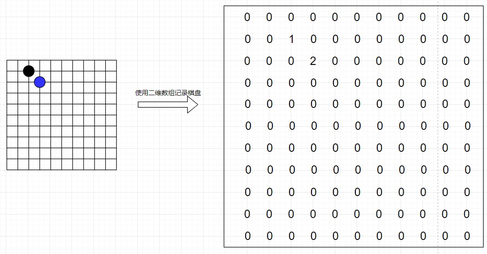
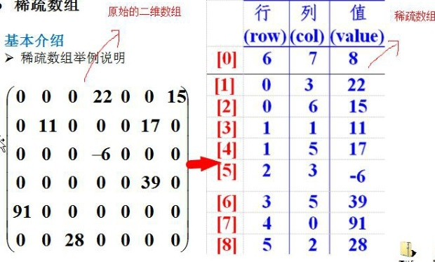
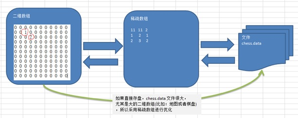
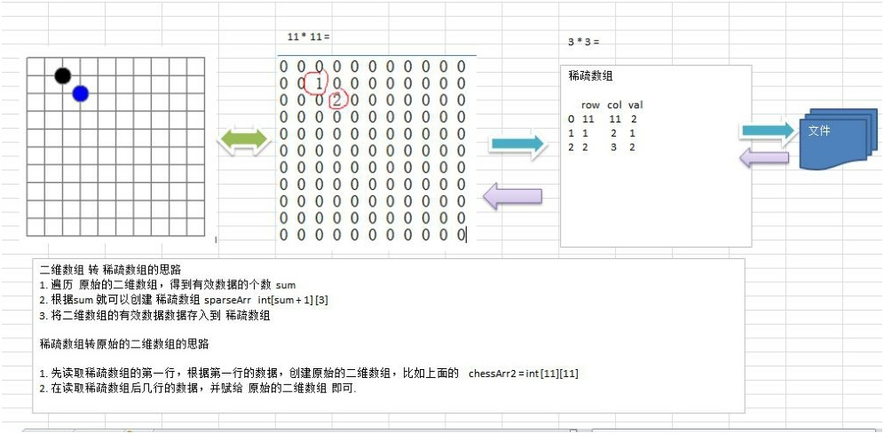

# 稀疏数组

## 1、应用场景

五子棋在下棋时的子位置在存储时，棋子位置转普通数组，普通数据转稀疏数组，从而达到数据压缩的目的，展出时是逆向过程，稀疏数组转普通数组，普通数组转棋子位置。





## 2、问题分析

因为该二维数组的很多值是默认值 0, 因此记录了**很多没有意义的数据**.->**稀疏数组**。

## 3、稀疏数组原理

稀疏数组的处理方法是:
1) 记录数组**一共有几行几列，有多少个不同**的值
2) 把具有不同值的元素的行列及值记录在一个小规模的数组中，从而**缩小程序**的规模

## 4、应用分析

1)使用稀疏数组，来保留类似前面的二维数组(棋盘、地图等等)
2)把稀疏数组存盘，并且可以从新恢复原来的二维数组数
3)整体思路分析





二维数组转稀疏数组的思路：

1、遍历原始的二维数组，得到有效数据的个数sum

2、根据sum就可以创建稀疏数组sparseArr int [sum + 1] [3]

3、将二维数组的有效数据存入稀疏数组中

稀疏数组转原始的二维数组的思路

1、先读取稀疏数组的第一行，根据第一行的数据，创建原始的二维数组，比如上面的 chessArr2 = int [11] [11]

2、在读取稀疏数组后几行的数据，并赋给原始的二维数组即可。

## 5、代码实现

```java
public class SparseArray {

    public static void main(String[] args){
        //创建一个原始的二维数组 11 * 11
        //0:表示没有棋子，1:表示黑子,2:表示篮子
        int arr[][] = new int[11][11];
        arr[1][2] = 1;
        arr[2][3] = 2;
        arr[4][5] = 2;
        //输出原始的二维数组
        System.out.println("原始的二维数组:");
        for (int[] row: arr){
            for (int data: row){
                System.out.printf("%d\t",data);
            }
            System.out.println();
        }
        //将二维数组转稀疏数组的思想
        //1.选遍历二维数组得到非0数据的个数
        int sum = 0;
        for (int i=0;i<11;i++){
            for (int j=0;j<11;j++){
                if (arr[i][j]!=0){
                    sum++;
                }
            }
        }
        //2.创建对应的稀疏数组
        int sparseArr[][] = new int[sum + 1][3];
        //给稀疏数组赋值
        sparseArr[0][0] = 11;
        sparseArr[0][1] = 11;
        sparseArr[0][2] = sum;

        //遍历二维数组，将非0的数值放到sparseArr中
        //count用于记录是第几个非0数据
        int count = 0;
        for (int i=0;i<11;i++){
            for (int j=0;j<11;j++){
                if (arr[i][j]!=0){
                    count++;
                    sparseArr[count][0] = i;
                    sparseArr[count][1] = j;
                    sparseArr[count][2] = arr[i][j];
                }
            }
        }
        //输出稀疏数组的形式
        System.out.println();
        System.out.println("得到的稀疏数组为:");
        for (int i=0;i<sparseArr.length;i++){
            System.out.printf("%d\t%d\t%d\t\n",sparseArr[i][0],sparseArr[i][1],sparseArr[i][2]);
        }
        System.out.println();
        //将稀疏数组 --》 恢复成 原始的二维数组
		/*
		 *  1. 先读取稀疏数组的第一行，根据第一行的数据，创建原始的二维数组，比如上面的  chessArr2 = int [11][11]
		 *  2. 在读取稀疏数组后几行的数据，并赋给 原始的二维数组 即可.
		 */
        //1. 先读取稀疏数组的第一行，根据第一行的数据，创建原始的二维数组
        int arr2[][] = new int[sparseArr[0][0]][sparseArr[0][1]];
        //2.在读取稀疏数组后几行的数据(从第二行开始),并赋给原始的二维数组
        for (int i=1;i<sparseArr.length;i++){
            arr2[sparseArr[i][0]][sparseArr[i][1]] = sparseArr[i][2];
        }
        //输出恢复后的二维数组
        System.out.println();
        System.out.println("恢复后的二维数组:");
        for (int[] row:arr2){
            for (int data:row){
                System.out.printf("%d\t",data);
            }
            System.out.println();
        }
    }
}

```

