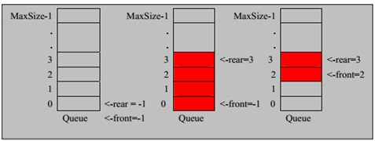

# 环形队列

## 1、介绍

对前面的数组模拟队列的优化，充分利用数组. 因此将数组看做是一个环形的。(通过取模的方式来实现即可)

## 2、分析

1、尾索引的下一个为头索引时表示队列满，即将队列容量空出一个作为约定,这个在做判断队列满的时候需要注意 (rear + 1) % maxSize == front 满]

2、rear == front [空]
3、测试示意图:



## 3、思路

思路如下:

1. front 变量的含义做一个调整： front 就指向队列的第一个元素, 也就是说 arr[front] 就是队列的第一个元素front 的初始值 = 0

2. rear 变量的含义做一个调整：rear 指向队列的最后一个元素的后一个位置. 因为希望空出一个空间做为约定.rear 的初始值 = 0

3. 当队列满时，条件是 (rear + 1) % maxSize == front 【满】

4. 对队列为空的条件， rear == front 空

5. 当我们这样分析， 队列中有效的数据的个数  (rear + maxSize - front) % maxSize  // rear = 1 front = 0 

6. 我们就可以在原来的队列上修改得到，一个环形队列

## 4、环形队列代码

```java
public class CircleArray {
    //数组的最大容量
    private int maxSize;
    //front变理的含义做一个调整,front就指向队列的第一个元素,也就是说arr[front]就是队列的第一个元素
    //front初始值为0
    private int front;
    //rear变理的含义做一个调整,rear指向队列的最后一个元素的后一个位置，因为希望空出一个空间做为约定。
    //rear的初始值为0
    //队列尾
    private int rear;
    //该数组用于存放数据，模拟队列
    private int[] arr;

    public CircleArray(int maxSize){
        this.maxSize = maxSize;
        arr = new int[maxSize];
    }

    //判断队列是否满
    public boolean isFull(){
        return (rear + 1)%maxSize == front;
    }

    //判断队列是否为空
    public boolean isEmpty(){
        return rear == front;
    }

    public void addQueue(int n){
        //判断队列是否满
        if (isFull()){
            System.out.println("队列已满，不能再加入数据");
            return;
        }
        //直接添加数据到队列里
        arr[rear] = n;
        //将rear后移，这里必须考虑取模
        rear = (rear + 1)%maxSize;
    }

    //获取队列的数据，出队列
    public int getQueue(){
        //判断队列是否为空
        if (isEmpty()){
            //通过抛出异常
            throw new RuntimeException("队列为空,不能取数据");
        }
        //这里需要分析出front是指向队列的第一个元素
        //1.先把front对应的值保留到一个临时变量
        //2.将front后移，考虑取模
        //3.将临时保存的变量返回
        int value = arr[front];
        front = (front + 1) % maxSize;
        return value;
    }
    //显示队列的所有数据
    public void showQueue(){
        //判断是否为空
        if (isEmpty()){
            System.out.println("队列为空，没有数据");
            return;
        }
        //思路:从front开始遍历，遍历多少个元素
        for (int i=front; i<front+size(); i++){
            System.out.printf("arr[%d]=%d\n", i%maxSize,arr[i%maxSize]);
        }
    }

    //求出当前队列有效数据的个数
    public int size(){
        //rear = 2
        //front = 1
        //maxSize = 3
        return (rear + maxSize - front) % maxSize;
    }

    //显示队列的头数据，注意不是取出数据
    public int headQueue(){
        //判断是否为空
        if (isEmpty()){
            throw new RuntimeException("队列为空，没有数据...");
        }
        return arr[front];
    }

}

```

## 5、测试代码

```java
public class CircleArrayTestCase {

    public static void main(String[] args){
        System.out.println("测试基于数组的环形队列...");
        //创建环形队列
        //说明设置4，其队列的有效数据最大为3
        CircleArray queue = new CircleArray(4);
        char key = ' ';
        Scanner scanner = new Scanner(System.in);
        boolean loop = true;
        while (loop){
            System.out.println("s(show): 显示队列");
            System.out.println("e(exit): 退出程序");
            System.out.println("a(add): 添加数据到队列");
            System.out.println("g(get): 从队列取出数据");
            System.out.println("h(head): 查看队列头的数据");
            //接收一个字符
            key = scanner.next().charAt(0);
            switch (key){
                case 's':
                    queue.showQueue();
                    break;
                case 'a':
                    System.out.println("输出一个数");
                    int value = scanner.nextInt();
                    queue.addQueue(value);
                    break;
                case 'g':
                    try {
                        int res = queue.getQueue();
                        System.out.printf("取出的数据是%d\n",res);
                    }catch (Exception e){
                        e.printStackTrace();
                    }
                case 'h':
                    try {
                        int res = queue.headQueue();
                        System.out.printf("队列头的数据是%d\n",res);
                    }catch (Exception e){
                        e.printStackTrace();
                    }
                    break;
                case 'e':
                    scanner.close();
                    loop = false;
                    break;
                default:
                    break;
            }
        }
        System.out.println("程序退出...");
    }
}

```

