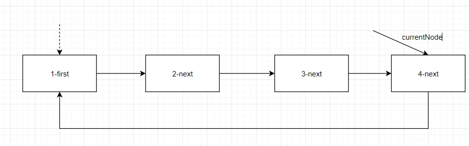
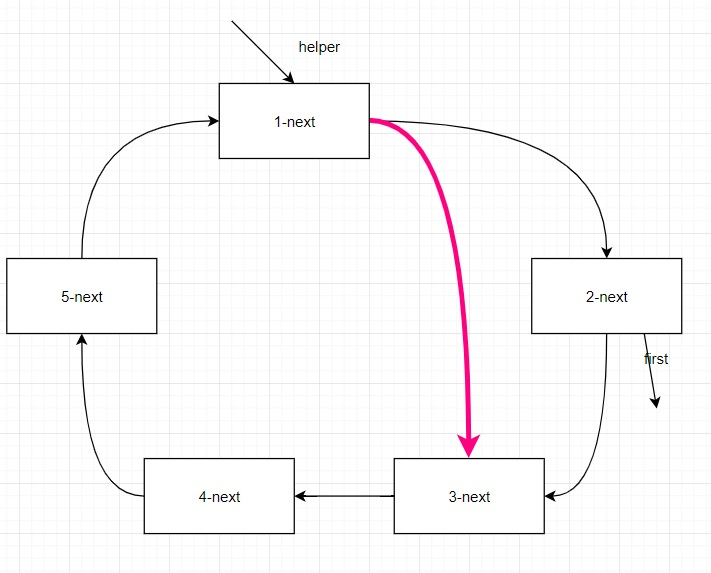

# 单向环形链表

## 1、介绍

单向环形链表的一个经典案例就是约瑟夫问题。

Josephu问题：设编号为1，2，.....n的n个人围坐一圈，约定编号为k(1<= k <=n)的人从1开始报数，数到m的那个人出列，他的下一位又从1开始报数，数到m的那个人又出列，以此类推，直到所有人出列为止，由此产生一个出队编号的序列。

## 2、分析

用一个不带头节点的循环链表来处理约瑟夫问题，先构造一个有n个节点的单向循环链表，然后由k节点起开始计数，计到m时，对应节点从链表中删除，然后再从被删除节点的下一个节点又开始从1计数，直到最后一个节点从链表中删除，算法结束。

## 3、思路



**构建**一个单向的环形链表思路：

- 先创建第一个节点让first指向该节点，并形成环形
- 后面当我们每创建一个新的节点，就把该节点加入到已有的环形链表中即可

**遍历**环形链表

- 先让一个辅助指针（变量）currentNode指向first节点
- 然后通过一个while循环遍历环形链表即可currentNode.next == first结束

**约瑟夫问题思路分析**



> n=5,即有5个人
> k=1,从第一个人开始
> m=2,数2下

1.需求创建一个辅助指针(变量)helper，事先应该指向环形链表的最后这个节点（补充:报数前先让first和helper移动k-1次）

2.当报数时，让first和helper指针同时移动m-1次

3.这时就可以将first指向的节点出圈
first = first.next
helper.next = first

原来first指向的节点就没有任何引用，就会被回收

出圈的顺序:2->4->1->5->3


## 4、代码

```java
import lombok.extern.slf4j.Slf4j;

/**
 * @description:
 * 单向环形链表
 * @author:mangxiao2018@126.com
 * @date:2021-7-22
 */
@Slf4j(topic = "c.CircleSingleLinkedList")
public class CircleSingleLinkedList {

    public static void main(String[] args){
        // 测试一把看看构建环形链表，和遍历是否ok
        CircleSingleLinkedList circleSingleLinkedList = new CircleSingleLinkedList();
        circleSingleLinkedList.addNode(5);// 加入5个节点
        circleSingleLinkedList.showNode();

        //测试一把节点出圈是否正确
        circleSingleLinkedList.countNode(1, 2, 5); // 2->4->1->5->3
        //String str = "7*2*2-5+1-5+3-3";
    }

    // 创建一个first节点,当前没有编号
    private Node first = null;

    // 添加节点，构建成一个环形的链表
    public void addNode(int nums) {
        // nums 做一个数据校验
        if (nums < 1) {
            log.debug("nums的值不正确");
            return;
        }
        Node currentNode = null; // 辅助指针，帮助构建环形链表
        // 使用for来创建我们的环形链表
        for (int i = 1; i <= nums; i++) {
            // 根据编号，创建节点
            Node node = new Node(i);
            // 如果是第一个节点
            if (i == 1) {
                first = node;
                first.setNext(first); // 构成环
                currentNode = first; // 让currentNode指向第一个节点
            } else {
                currentNode.setNext(node);
                node.setNext(first);
                currentNode = node;
            }
        }
    }

    // 遍历当前的环形链表
    public void showNode() {
        // 判断链表是否为空
        if (first == null) {
            log.debug("没有任何节点~~");
            return;
        }
        // 因为first不能动，因此我们仍然使用一个辅助指针完成遍历
        Node currentNode = first;
        while (true) {
            log.debug("节点的编号 %d \n", currentNode.getNo());
            if (currentNode.getNext() == first) {// 说明已经遍历完毕
                break;
            }
            currentNode = currentNode.getNext(); // currentNode后移
        }
    }

    // 根据用户的输入，计算出节点出圈的顺序
    /**
     *
     * @param startNo
     *            表示从第几个节点开始数数
     * @param countNum
     *            表示数几下
     * @param nums
     *            表示最初有多少节点在圈中
     */
    public void countNode(int startNo, int countNum, int nums) {
        // 先对数据进行校验
        if (first == null || startNo < 1 || startNo > nums) {
            log.debug("参数输入有误， 请重新输入");
            return;
        }
        // 创建要给辅助指针,帮助完成节点出圈
        Node helper = first;
        // 需求创建一个辅助指针(变量) helper , 事先应该指向环形链表的最后这个节点
        while (true) {
            if (helper.getNext() == first) { // 说明helper指向最后节点
                break;
            }
            helper = helper.getNext();
        }
        //节点报数前，先让 first 和  helper 移动 k - 1次
        for(int j = 0; j < startNo - 1; j++) {
            first = first.getNext();
            helper = helper.getNext();
        }
        //当节点报数时，让first 和 helper 指针同时 的移动  m  - 1 次, 然后出圈
        //这里是一个循环操作，知道圈中只有一个节点
        while(true) {
            if(helper == first) { //说明圈中只有一个节点
                break;
            }
            //让 first 和 helper 指针同时 的移动 countNum - 1
            for(int j = 0; j < countNum - 1; j++) {
                first = first.getNext();
                helper = helper.getNext();
            }
            //这时first指向的节点，就是要出圈的节点
            System.out.printf("节点%d出圈\n", first.getNo());
            //这时将first指向的节点出圈
            first = first.getNext();
            helper.setNext(first); //

        }
        log.debug("最后留在圈中的节点编号 %d \n", first.getNo());

    }
}
```


