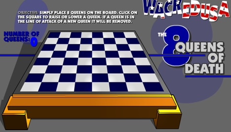
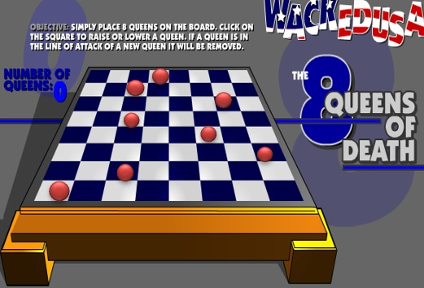

# 递归-八皇后问题

## 1、介绍

八皇后问题，是一个古老而著名的问题，是回溯算法的典型案例。该问题是国际西洋棋棋手马克斯·贝瑟尔于1848年提出：在8×8格的国际象棋上摆放八个皇后，使其不能互相攻击，即：任意两个皇后都不能处于同一行、同一列或同一斜线上，问有多少种摆法。



## 2、思路

1. 第一个皇后先放第一行第一列
2. 第二个皇后放在第二行第一列、然后判断是否OK， 如果不OK，继续放在第二列、第三列、依次把所有列都放完，找到一个合适
3. 继续第三个皇后，还是第一列、第二列……直到第8个皇后也能放在一个不冲突的位置，算是找到了一个正确解
4. 当得到一个正确解时，在栈回退到上一个栈时，就会开始回溯，即将第一个皇后，放到第一列的所有正确解，全部得到.
5. 然后回头继续第一个皇后放第二列，后面继续循环执行 1,2,3,4的步骤 

> 说明：
>
> 理论上应该创建一个二维数组来表示棋盘，但是实际上可以通过算法，用一个一维数组即可解决问题.
>
>  arr[8] = {0 , 4, 7, 5, 2, 6, 1, 3} //对应arr 下标 表示第几行，即第几个皇后，arr[i] = val , val 表示第i+1个皇后，放在第i+1行的第val+1列



## 3、代码

```java
/**
 * @description:8皇后问题
 * @author:mangxiao
 * @date:2021-6-20
 */
public class Queue8 {
    // 定义一个max表示共有多少个皇后
    int max = 8;
    //定义数组array, 保存皇后放置位置的结果，比如 arr = {0, 4, 7, 5, 2, 6, 1, 3}
    int[] array = new int[max];
    static int count = 0;

    static int judgeCount = 0;

    public static void main(String[] args){
        Queue8 q = new Queue8();
        q.check(0);
        System.out.printf("一共有%d种解法", count);
        System.out.printf("一共判断冲突的次数%d次", judgeCount);

    }

    /**
     * 特别注意:check是每次递归时，进入到check中都有 for(int i = 0; i < max; i++)因此会有回溯
     * @param n 放置第n个皇后
     */
    private void check(int n){
        if (n == max){
            print();
            return;
        }
        //依次放入皇后，并判断是否冲突
        for(int i = 0; i < max; i++){
            //先把当前的皇后n,放到该行的第1列
            array[n] = i;
            // 判断当放置第n个皇后到第i列时，是否冲突
            if (judge(n)){
                //接着放n+1个皇后，即开始递归
                check(n + 1);
            }
            //如果冲突，就继续执行array[n] = i;即将第n个皇后，放置在本行得后移的一个位置
        }
    }

    /**
     * 查看当我们放置第n个皇后，就是检测该皇后是否和前面已经摆放的皇后冲突
     * 说明:
     * 1.array[i] == array[n]表示判断第n个皇后是否和前面的第n-1个皇后在同一列
     * 2.Math.abs(n - i) == Math.abs(array[n] - array[i])表示判断第n个皇后是否和第i个皇后是否在同一斜线
     * 3.判断是否在同一行，没有必要，n每次都在递增
     * n = 1,放置第2列 n = 1,array[1] = 1
     * Math.abs(1-0) == 1, Math.abs(array[n] - array[i]) = Math.abs(1-0) = 1
     * @param n 表示第n个皇后
     * @return
     */
    private boolean judge(int n){
        judgeCount ++;
        for (int i = 0; i < n; i++){
            if (array[i] == array[n] || Math.abs(n - i) == Math.abs(array[n] - array[i])){
                return false;
            }
        }
        return true;
    }

    /**
     * 将皇后摆放后的位置输出
     */
    private void print(){
        count ++;
        for (int i = 0; i < array.length; i++){
            System.out.print(array[i] + " ");
        }
        System.out.println();
    }
}
```


