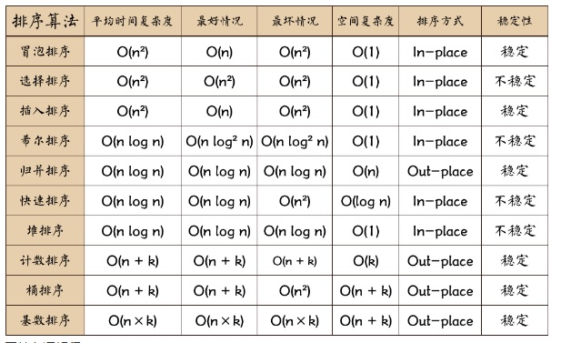

# 排序算法对比总结

## 1、算法对比

## 2、术语解释

1. 稳定：如果a原本在b前面，而a=b，排序之后a仍然在b的前面；
2. 不稳定：如果a原本在b的前面，而a=b，排序之后a可能会出现在b的后面；
3. 内排序：所有排序操作都在内存中完成；
4. 外排序：由于数据太大，因此把数据放在磁盘中，而排序通过磁盘和内存的数据传输才能进行；
5. 时间复杂度：一个算法执行所耗费的时间。
6. 空间复杂度：运行完一个程序所需内存的大小。
7. n: 数据规模
8. k: “桶”的个数
9. In-place:    不占用额外内存
10. Out-place: 占用额外内存

