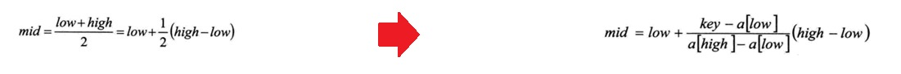

# 插值查找算法

## 1、介绍

在一个整数数组中，通过插值查找算法查找是否存在给出的值，如果存在返回该值所在下标。

## 2、思路

1. 插值查找算法类似于二分查找，不同的是插值查找每次从自适应mid处开始查找。

2. 将折半查找中的求mid 索引的公式 , low 表示左边索引left, high表示右边索引right.key 就是前面我们讲的  findVal

   

3. int mid = low + (high - low) * (key - arr[low]) / (arr[high] - arr[low]) ;// 插值索

   - 对应前面的代码公式：

      int mid = left + (right – left) * (findVal – arr[left]) / (arr[right] – arr[left]) 

4. 举例说明插值查找算法 1-100 的数组


**插值查找注意事项：**

1. 对于数据量较大，关键字分布比较均匀的查找表来说，采用插值查找, 速度较快.
2. 关键字分布不均匀的情况下，该方法不一定比折半查找要好

## 3、代码

请对一个有序数组进行插值查找 {1,8, 10, 89, 1000, 1234} ，输入一个数看看该数组是否存在此数，并且求出下标，如果没有就提示"没有这个数"。

```java
import lombok.extern.slf4j.Slf4j;

/**
 * @description:插值查找算法
 * @author:mangxiao2018@126.com
 * @date:2021-8-13
 */
@Slf4j(topic = "c.InsertValueSearch")
public class InsertValueSearch {
    public static void main(String[] args) {
        int arr[] = { 1, 8, 10, 89,1000,1000, 1234 };

        int index = insertValueSearch(arr, 0, arr.length - 1, 1234);
        //int index = binarySearch(arr, 0, arr.length, 1);
        log.debug("index = " + index);
    }

    /**
     * 二分查找
     * @param arr
     * @param left
     * @param right
     * @param findVal
     * @return
     */
    public static int binarySearch(int[] arr, int left, int right, int findVal) {
        log.debug("二分查找被调用~");
        // 当 left > right 时，说明递归整个数组，但是没有找到
        if (left > right) {
            return -1;
        }
        int mid = (left + right) / 2;
        int midVal = arr[mid];
        if (findVal > midVal) { // 向 右递归
            return binarySearch(arr, mid + 1, right, findVal);
        } else if (findVal < midVal) { // 向左递归
            return binarySearch(arr, left, mid - 1, findVal);
        } else {
            return mid;
        }
    }
    /**
     *编写插值查找算法
     * 说明：插值查找算法，也要求数组是有序的
     * @param arr 数组
     * @param left 左边索引
     * @param right 右边索引
     * @param findVal 查找值
     * @return 如果找到，就返回对应的下标，如果没有找到，返回-1
     */
    public static int insertValueSearch(int[] arr, int left, int right, int findVal) {
        log.debug("插值查找次数~~");
        //注意：findVal < arr[0]  和  findVal > arr[arr.length - 1] 必须需要
        //否则我们得到的 mid 可能越界
        if (left > right || findVal < arr[0] || findVal > arr[arr.length - 1]) {
            return -1;
        }
        // 求出mid, 自适应
        int mid = left + (right - left) * (findVal - arr[left]) / (arr[right] - arr[left]);
        int midVal = arr[mid];
        if (findVal > midVal) { // 说明应该向右边递归
            return insertValueSearch(arr, mid + 1, right, findVal);
        } else if (findVal < midVal) { // 说明向左递归查找
            return insertValueSearch(arr, left, mid - 1, findVal);
        } else {
            return mid;
        }
    }
}
```


