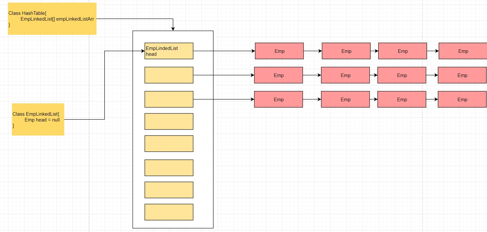

# 哈希表

## 1、介绍

散列表（Hash table，也叫哈希表），是根据关键码值(Key value)而直接进行访问的数据结构。也就是说，它通过把关键码值映射到表中一个位置来访问记录，以加快查找的速度。这个映射函数叫做散列函数，存放记录的数组叫做散列表。

## 2、思路



数组+链表，数组的每个节点挂一个链表，对于要写入或要查询的数据是否在本数组的某一个节点上或这个节点后的链表中，通过取模来划分。

## 3、代码

### 3.1、测试类代码

```java
import lombok.extern.slf4j.Slf4j;

import java.util.Scanner;

/**
 * @description:hash-table实例测试
 * @author:mangxiao2018@126.com
 * @date:2021-8-16
 */
@Slf4j(topic = "c.MainTest")
public class MainTest {
    public static void main(String[] args){
        //创建哈希表
        HashTable ht = new HashTable(7);
        //写一个简单的菜单
        String key = "";
        Scanner scanner = new Scanner(System.in);
        while(true) {
            log.debug("add:  添加雇员");
            log.debug("list: 显示雇员");
            log.debug("find: 查找雇员");
            log.debug("exit: 退出系统");

            key = scanner.next();
            switch (key) {
                case "add":
                    log.debug("输入id");
                    int id = scanner.nextInt();
                    log.debug("输入名字");
                    String name = scanner.next();
                    //创建 雇员
                    Node emp = new Node(id, name);
                    ht.add(emp);
                    break;
                case "list":
                    ht.list();
                    break;
                case "find":
                    log.debug("请输入要查找的id");
                    id = scanner.nextInt();
                    ht.findNodeById(id);
                    break;
                case "exit":
                    scanner.close();
                    System.exit(0);
                default:
                    break;
            }
        }
    }
}
```

### 3.2、哈希表代码

```java
import lombok.extern.slf4j.Slf4j;

/**
 * @description:hash-table
 * @author:mangxiao2018@126.com
 * @date:2021-8-16
 */
@Slf4j(topic = "c.HashTable")
public class HashTable {

    private SingleLinkedList[] singleLinkedListArr;
    private int size;

    public HashTable(int size){
        this.size = size;
        singleLinkedListArr = new SingleLinkedList[size];
        for (int i = 0; i < size; i++){
            singleLinkedListArr[i] = new SingleLinkedList();
        }
    }

    public void add(Node node){
        int no = hash(node.id);
        singleLinkedListArr[no].add(node);
    }

    public void list(){
        for (int i=0; i<size; i++){
            singleLinkedListArr[i].list(i);
        }
    }

    public void findNodeById(int id){
        int no = hash(id);
        Node node = singleLinkedListArr[no].findNodeById(id);
        if (node != null){
            log.debug("在第%d条链表中找到,节点id=%d\n",(no + 1), id);
        }else{
            log.debug("在哈希表中没有找到该节点");
        }
    }

    /**
     * 取模法实现散列函数
     * @param id
     * @return
     */
    public int hash(int id){
        return id % size;
    }
}
```

### 3.3、链表代码

```java
import lombok.extern.slf4j.Slf4j;

/**
 * @description:hash-table单链表
 * @author:mangxiao2018@126.com
 * @date:2021-8-16
 */
@Slf4j(topic = "c.SingleLinkedList")
public class SingleLinkedList {
    private Node head;

    public void add(Node node){
        if (head == null){
            head = node;
            return;
        }
        Node currentNode = head;
        while (true){
            if (currentNode == null){
                break;
            }
            currentNode = currentNode.next;
        }
        currentNode.next = node;
    }

    public void list(int no){
        if (head == null){
            log.debug("第" + (no + 1) +"链表为空");
            return;
        }
        log.debug("第" + (no + 1) +"链表信息为:");
        Node currentNode = head;
        while (true){
            log.debug("id=%d, name=%s\t",currentNode.id,currentNode.name);
            if (currentNode.next == null){
                break;
            }
            currentNode = currentNode.next;
        }
        System.out.println();
    }

    public Node findNodeById(int id){
        if (head == null){
            log.debug("链表为空");
            return null;
        }
        Node currentNode = head;
        while (true){
            if (currentNode.id == id){
                break;
            }
            if (currentNode.next == null){
                currentNode = null;
                break;
            }
            currentNode = currentNode.next;
        }
        return currentNode;
    }
}
```

### 3.4、节点代码

```java
import lombok.extern.slf4j.Slf4j;

/**
 * @description:hash-table实例所需节点
 * @author:mangxiao2018@126.com
 * @date:2021-8-16
 */
@Slf4j(topic = "c.Node")
public class Node {

    public int id;
    public String name;
    public Node next;

    public Node(int id, String name){
        super();
        this.id = id;
        this.name = name;
    }
}
```

