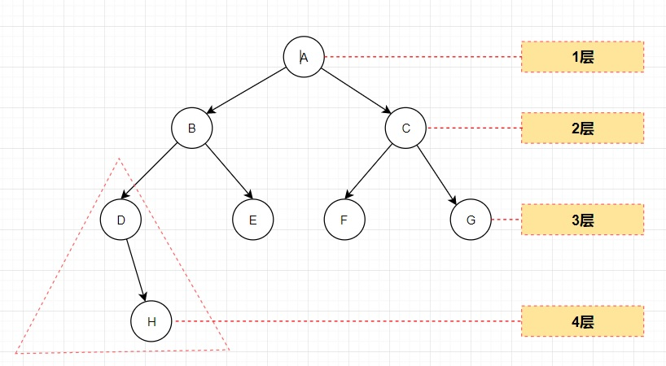

# 二叉树-树的介绍

## 1、树示意图

## 2、术语理解

1. 
   节点 （如A、B、C、D、E、F、G、H所有都是节点）
2. 根节点 （如A）
3. 父节点 (如C是F、G的父节点)
4. 子节点 (如C是A的子节点)
5. 叶子节点 (没有子节点的节点) （如H、E、F、G没有子节点，称为叶子节点）
6. 节点的权(节点值)
7. 路径(从root节点找到该节点的路线)
8. 层 （如上图分成4层）
9. 子树 （红虚框的是以D为根的子树）
10. 树的高度(最大层数)
11. 森林 :多颗子树构成森林