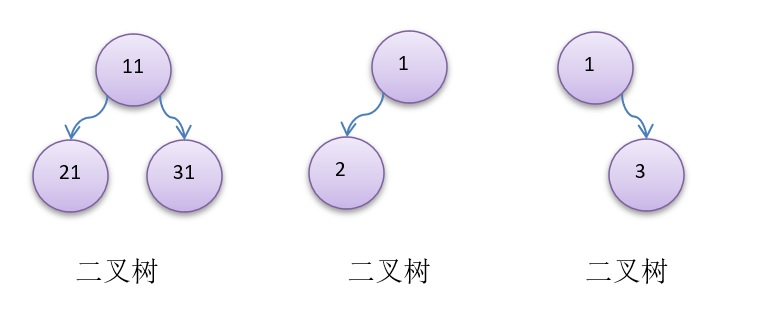
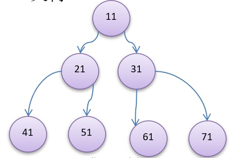
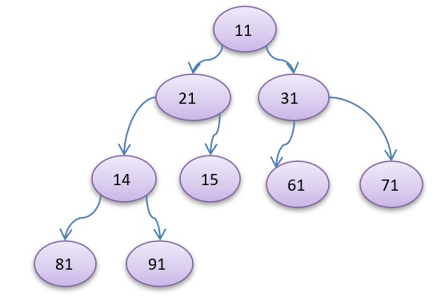

# 二叉树

## 1、基本概念

树有很多种，每个节点最多只能有两个子节点的一种形式称为二叉树

二叉树的子节点分为左节点和右节点。

## 2、满二叉树

如果该二叉树的所有叶子节点都在最后一层，并且结点总数= 2^n -1 , n 为层数，则我们称为满二叉树

## 3、完全二叉树

如果该二叉树的所有叶子节点都在最后一层或者倒数第二层，而且最后一层的叶子节点在左边连续，倒数第二层的叶子节点在右边连续，我们称为完全二叉树。

*完全二叉树 ， 如果把 (61)节点删除， 就不是完全二叉树了,因为叶子节点不连续了*

