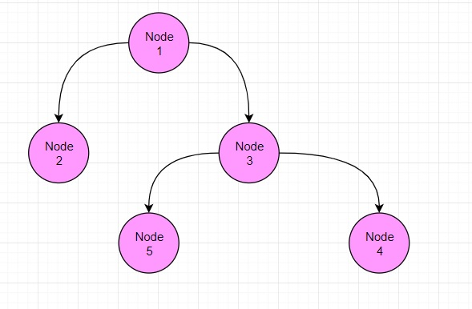

# 二叉树-查找指定节点

## 1、介绍

**要求**

1、请编写前序查找，中序查找和后序查找的方法。
2、并分别使用三种查找方式，查找 id = 5 的节点
3、并分析各种查找方式，分别比较了多少次

## 2、思路

使用前序、中序、后序的方式来查询指定的节点

**前序查找思路：**

1. 先判断当前节点的id是否等于要查找的
2. 如果是相等，则返回当前节点
3. 如果不等，则判断当前节点的左子节点是否为空，如果不为空，则递归前序查找
4. 如果左递归前序查找，找到节点，则返回，否则继续判断，当前的节点的右子节点是否为空，如果不为空，则继续向右递归前序查找

**中序查找思路：**

1. 判断当前节点的左子节点是否为空，如果不为空，则递归中序查找
2. 如果找到，则返回，如果没有找到，就和当前节点比较，如果是则返回当前节点，否则继续进行右递归的中序查找
3. 如果右递归中序查找，找到就返回，否则返回null

**后序查找思路：**

1. 判断当前节点的左子节点是否为空，如果不为空，则递归后序查找
2. 如果找到，就返回，如果没有找到，就判断当前节点的右子节点是否为空，如果不为空，则右递归进行后序查找，如果找到，就返回
3. 就和当前节点进行比较，如果是则返回，否则返回null



## 3、代码

```java
```

