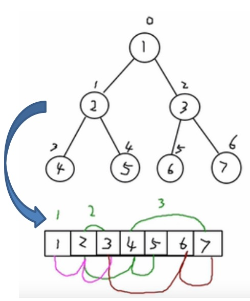
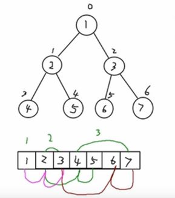

# 二叉树-顺序存储

## 1、介绍

从数据存储来看，数组存储方式和树的存储方式可以相互转换，即数组可以转换成树，树也可以转换成数组，如下图所示。



## 2、思路

**要求:**
上图的二叉树的结点，要求以数组的方式来存放 arr : [1, 2, 3, 4, 5, 6, 6]
要求在遍历数组 arr时，仍然可以以前序遍历，中序遍历和后序遍历的方式完成结点的遍历

**顺序存储二叉树的特点:**

1. 顺序二叉树通常只考虑完全二叉树
2. 第n个元素的左子节点为  2 * n + 1 
3. 第n个元素的右子节点为  2 * n + 2
4. 第n个元素的父节点为  (n-1) / 2
5. n : 表示二叉树中的第几个元素(按0开始编号如图所示)



## 3、代码

需求: 给你一个数组 {1,2,3,4,5,6,7}，要求以二叉树前序遍历的方式进行遍历。 前序遍历的结果应当为 1,2,4,5,3,6,7

二叉树存储测试

```java
/**
 * @description:二叉树存储测试
 * @author:mangxiao2018@126.com
 * @date:2021-9-8
 */
public class BinaryTreeStoreTestCase {

    public static void main(String[] args){
        int[] arr = {7, 3, 10, 12, 5, 1, 9, 2};
        BinaryStoreTree binarySortTree = new BinaryStoreTree();
        //循环的添加结点到二叉排序树
        for(int i = 0; i< arr.length; i++) {
            binarySortTree.add(new Node(arr[i]));
        }

        //中序遍历二叉排序树
        System.out.println("中序遍历二叉排序树~");
        binarySortTree.middleOrderTraversal(); // 1, 3, 5, 7, 9, 10, 12

        //测试一下删除叶子结点


        binarySortTree.delNode(12);


        binarySortTree.delNode(5);
        binarySortTree.delNode(10);
        binarySortTree.delNode(2);
        binarySortTree.delNode(3);

        binarySortTree.delNode(9);
        binarySortTree.delNode(1);
        binarySortTree.delNode(7);


        System.out.println("root=" + binarySortTree.getRoot());


        System.out.println("删除结点后");
        binarySortTree.middleOrderTraversal();
    }
}
```

二叉存储树实现类

```java
/**
 * @description:二叉存储树
 * @author:mangxiao2018@126.com
 * @date:2021-9-8
 */
public class BinaryStoreTree {

    private Node root;

    public Node getRoot(){
        return root;
    }

    /**
     * 查找要删除的结点
     * @param value
     * @return
     */
    public Node search(int value) {
        if(root == null) {
            return null;
        } else {
            return root.search(value);
        }
    }

    /**
     * 查找父结点
     * @param value
     * @return
     */
    public Node searchParent(int value) {
        if(root == null) {
            return null;
        } else {
            return root.searchParent(value);
        }
    }

    /**
     * 编写方法:
     * 1. 返回的 以node 为根结点的二叉排序树的最小结点的值
     * 2. 删除node 为根结点的二叉排序树的最小结点
     * @param node 传入的结点(当做二叉排序树的根结点)
     * @return 返回的 以node 为根结点的二叉排序树的最小结点的值
     */
    public int delRightTreeMin(Node node) {
        Node target = node;
        //循环的查找左子节点，就会找到最小值
        while(target.getLeft() != null) {
            target = target.getLeft();
        }
        //这时 target就指向了最小结点
        //删除最小结点
        delNode(target.getValue());
        return target.getValue();
    }

    /**
     * 删除结点
     * @param value
     */
    public void delNode(int value) {
        if(root == null) {
            return;
        }else {
            //1.需求先去找到要删除的结点  targetNode
            Node targetNode = search(value);
            //如果没有找到要删除的结点
            if(targetNode == null) {
                return;
            }
            //如果我们发现当前这颗二叉排序树只有一个结点
            if(root.getLeft() == null && root.getRight() == null) {
                root = null;
                return;
            }

            //去找到targetNode的父结点
            Node parent = searchParent(value);
            //如果要删除的结点是叶子结点
            if(targetNode.getLeft() == null && targetNode.getRight() == null) {
                //判断targetNode 是父结点的左子结点，还是右子结点
                if(parent.getLeft() != null && parent.getLeft().getValue() == value) { //是左子结点
                    parent.setLeft(null);
                } else if (parent.getRight() != null && parent.getRight().getValue() == value) {//是由子结点
                    parent.setRight(null);
                }
            } else if (targetNode.getLeft() != null && targetNode.getRight() != null) { //删除有两颗子树的节点
                int minVal = delRightTreeMin(targetNode.getRight());
                targetNode.setValue(minVal);


            } else { // 删除只有一颗子树的结点
                //如果要删除的结点有左子结点
                if(targetNode.getLeft() != null) {
                    if(parent != null) {
                        //如果 targetNode 是 parent 的左子结点
                        if(parent.getLeft().getValue() == value) {
                            parent.setLeft(targetNode.getLeft());
                        } else { //  targetNode 是 parent 的右子结点
                            parent.setRight(targetNode.getLeft());
                        }
                    } else {
                        root = targetNode.getLeft();
                    }
                } else { //如果要删除的结点有右子结点
                    if(parent != null) {
                        //如果 targetNode 是 parent 的左子结点
                        if(parent.getLeft().getValue() == value) {
                            parent.setLeft(targetNode.getRight());
                        } else { //如果 targetNode 是 parent 的右子结点
                            parent.setRight(targetNode.getRight());
                        }
                    } else {
                        root = targetNode.getRight();
                    }
                }
            }
        }
    }

    /**
     * 添加结点的方法
     * @param node
     */
    public void add(Node node) {
        if(root == null) {
            root = node;//如果root为空则直接让root指向node
        } else {
            root.add(node);
        }
    }

    /**
     * 中序遍历
     */
    public void middleOrderTraversal() {
        if(root != null) {
            root.middleOrderTraversal();
        } else {
            System.out.println("二叉排序树为空，不能遍历");
        }
    }
}
```

节点类

```java
/**
 * @description:节点实体
 * @author:mangxiao2018@126.com
 * @date:2021-9-8
 */
public class Node {
    private int value;
    private Node left;
    private Node right;

    public Node(int value){
        this.value = value;
    }

    public int getValue() {
        return value;
    }

    public void setValue(int value) {
        this.value = value;
    }

    public Node getLeft() {
        return left;
    }

    public void setLeft(Node left) {
        this.left = left;
    }

    public Node getRight() {
        return right;
    }

    public void setRight(Node right) {
        this.right = right;
    }

    @Override
    public String toString() {
        return "Node{" +
                "value=" + value +
                '}';
    }

    /**
     * 查找要删除的结点
     * @param value 希望删除的结点的值
     * @return 如果找到返回该结点，否则返回null
     */
    public Node search(int value) {
        if(value == this.value) { //找到就是该结点
            return this;
        } else if(value < this.value) {//如果查找的值小于当前结点，向左子树递归查找
            //如果左子结点为空
            if(this.left  == null) {
                return null;
            }
            return this.left.search(value);
        } else { //如果查找的值不小于当前结点，向右子树递归查找
            if(this.right == null) {
                return null;
            }
            return this.right.search(value);
        }
    }

    /**
     * 查找要删除结点的父结点
     * @param value 要找到的结点的值
     * @return 返回的是要删除的结点的父结点，如果没有就返回null
     */
    public Node searchParent(int value) {
        //如果当前结点就是要删除的结点的父结点，就返回
        if((this.left != null && this.left.value == value) ||
                (this.right != null && this.right.value == value)) {
            return this;
        } else {
            //如果查找的值小于当前结点的值, 并且当前结点的左子结点不为空
            if(value < this.value && this.left != null) {
                return this.left.searchParent(value); //向左子树递归查找
            } else if (value >= this.value && this.right != null) {
                return this.right.searchParent(value); //向右子树递归查找
            } else {
                return null; // 没有找到父结点
            }
        }
    }

    /**
     * 添加结点的方法
     * 递归的形式添加结点，注意需要满足二叉排序树的要求
     * @param node
     */
    public void add(Node node) {
        if(node == null) {
            return;
        }
        //判断传入的结点的值，和当前子树的根结点的值关系
        if(node.value < this.value) {
            //如果当前结点左子结点为null
            if(this.left == null) {
                this.left = node;
            } else {
                //递归的向左子树添加
                this.left.add(node);
            }
        } else { //添加的结点的值大于 当前结点的值
            if(this.right == null) {
                this.right = node;
            } else {
                //递归的向右子树添加
                this.right.add(node);
            }
        }
    }

    /**
     * 中序遍历
     */
    public void middleOrderTraversal() {
        if(this.left != null) {
            this.left.middleOrderTraversal();
        }
        System.out.println(this);
        if(this.right != null) {
            this.right.middleOrderTraversal();
        }
    }
}
```

