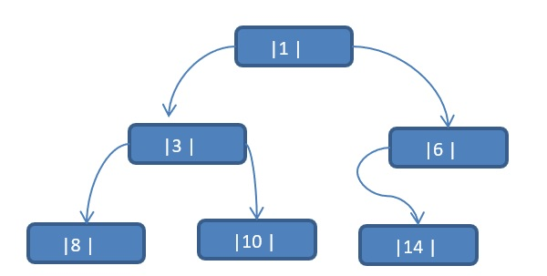
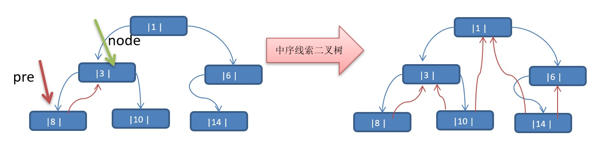

# 二叉树-线索化二叉树

## 1、介绍

1. n个结点的二叉链表中含有n+1  【公式 2n-(n-1)=n+1】 个空指针域。利用二叉链表中的空指针域，存放指向该结点在某种遍历次序下的前驱和后继结点的指针（这种附加的指针称为"线索"）

2. 这种加上了线索的二叉链表称为线索链表，相应的二叉树称为线索二叉树(Threaded BinaryTree)。根据线索性质的不同，线索二叉树可分为前序线索二叉树、中序线索二叉树和后序线索二叉树三种

3. 一个结点的前一个结点，称为前驱结点

4. 一个结点的后一个结点，称为后继结点

## 2、痛点

**问题**

将数列 {1, 3, 6, 8, 10, 14  } 构建成一颗二叉树.  n+1=7




**问题分析:** 

1. 当我们对上面的二叉树进行中序遍历时，数列为 {8, 3, 10, 1, 6, 14 }
2. 但是 6, 8, 10, 14 这几个节点的 左右指针，并没有完全的利用上.
3. 如果我们希望充分的利用 各个节点的左右指针， 让各个节点可以指向自己的前后节点,怎么办?**==解决方案-线索二叉树==**

## 3、思路

以一个例子进行分析：

将下面的二叉树，进行**中序线索二叉树**。中序遍历的数列为 {8, 3, 10, 1, 14, 6}


**思路分析**: 中序遍历的结果：{8, 3, 10, 1, 14, 6}



**说明:** 
**当线索化二叉树后，Node节点的 属性 left 和 right ，有如下情况:**

1. left 指向的是左子树，也可能是指向的前驱节点. 比如 ① 节点 left 指向的左子树, 而 ⑩ 节点的 left 指向的就是前驱节点.

2. right指向的是右子树，也可能是指向后继节点，比如 ① 节点right 指向的是右子树，而⑩ 节点的right 指向的是后继节点.

## 4、代码

**1、CueingBinaryTreeTestCase代码**

```java
/**
 * @description:线索化二叉树测试
 * @author:mangxiao2018@126.com
 * @date:2021-9-26
 */
public class CueingBinaryTreeTestCase {
    public static void main(String[] args){
        //先需要创建一棵二叉树
        CueingBinaryTree tree = new CueingBinaryTree();
        //创建需要的结点
        Node root = new Node(1, 1);
        Node node2 = new Node(3, 3);
        Node node3 = new Node(6, 6);
        Node node4 = new Node(8, 8);
        Node node5 = new Node(10, 10);
        Node node6 = new Node(14, 14);

        //说明，我们先手动创建该二叉树，后面我们学习递归的方式创建二叉树
        root.setLeft(node2);
        root.setRight(node3);
        node2.setRight(node4);
        node2.setLeft(node5);
        node3.setRight(node6);

        //测试中序线索化
        tree.setRoot(root);
        tree.cueingNodes();

        //测试: 以10号节点测试
        Node leftNode = node5.getLeft();
        Node rightNode = node5.getRight();

        System.out.println("10号结点的前驱结点是 ="  + leftNode); //3
        System.out.println("10号结点的后继结点是="  + rightNode); //1

        //当线索化二叉树后，能在使用原来的遍历方法
        System.out.println("使用线索化的方式遍历 线索化二叉树");
        tree.cueingList();
    }
}
```

**2、CueingBinaryTree代码**

```java
/**
 * @description:二叉树
 * @author:mangxiao2018@126.com
 * @date:2021-9-26
 */
public class CueingBinaryTree {
    private Node root;
    //为了实现线索化，需要创建要给指向当前结点的前驱结点的指针
    //在递归进行线索化时，pre 总是保留前一个结点
    private Node pre = null;
    public void setRoot(Node root){
        this.root = root;
    }

    public void cueingNodes(){
        this.cueingNodes(root);
    }

    /**
     * 遍历线索化二叉树
     */
    public void cueingList(){
        //定义一个变量，存储当前遍历的结点，从root开始
        Node node = root;
        while (node != null){
            //循环的找到leftType == 1的结点，第一个找到就是8结点
            //后面随着遍历而变化,因为当leftType==1时，说明该结点是按照线索化
            //处理后的有效结点
            while (node.getLeftType() == 0){
                node = node.getLeft();
            }
            //打印当前这个结点
            System.out.println(node);
            //如果当前结点的右指针指向的是后继结点,就一直输出
            while (node.getRightType() == 1){
                node = node.getRight();
                System.out.println(node);
            }
            //替换这个遍历的结点
            node = node.getRight();
        }
    }

    /**
     * 对二叉树进行中序线索化
     * @param node 就是当前需要线索化的结点
     */
    public void cueingNodes(Node node){
        //如果node==null, 不能线索化
        if(node == null) {
            return;
        }

        //(一)先线索化左子树
        cueingNodes(node.getLeft());
        //(二)线索化当前结点[有难度]

        //处理当前结点的前驱结点
        //以8结点来理解
        //8结点的.left = null , 8结点的.leftType = 1
        if(node.getLeft() == null) {
            //让当前结点的左指针指向前驱结点
            node.setLeft(pre);
            //修改当前结点的左指针的类型,指向前驱结点
            node.setLeftType(1);
        }

        //处理后继结点
        if (pre != null && pre.getRight() == null) {
            //让前驱结点的右指针指向当前结点
            pre.setRight(node);
            //修改前驱结点的右指针类型
            pre.setRightType(1);
        }
        //!!! 每处理一个结点后，让当前结点是下一个结点的前驱结点
        pre = node;

        //(三)在线索化右子树
        cueingNodes(node.getRight());
    }
    /**
     * 删除节点
     * @param no
     */
    public void delNode(int no){
        if (root != null){
            //如果只有一个root结点, 这里立即判断root是不是就是要删除结点
            if (root.getNo() == no){
                root = null;
            }else{
                //递归删除
                root.delNode(no);
            }
        }else{
            System.out.println("空树,不能删除.");
        }
    }

    /**
     * 前序遍历
     */
    public void preOrderTraversal(){
        if (this.root != null){
            this.root.preOrderTraversal();
        }else{
            System.out.println("二叉树为空,无法遍历.");
        }
    }

    /**
     * 中序遍历
     */
    public void middleOrderTraversal(){
        if (this.root != null){
            this.root.middleOrderTraversal();
        }else{
            System.out.println("二叉树为空，无法遍历.");
        }
    }

    /**
     * 后序遍历
     */
    public void postOrderTraversal(){
        if (this.root != null){
            this.root.postOrderTraversal();
        }else{
            System.out.println("二叉树为空，无法遍历.");
        }
    }

    /**
     * 前序遍历
     * @param no
     * @return
     */
    public Node preOrderSearch(int no){
        if (root != null){
            return root.preOrderSearch(no);
        }else{
            return null;
        }
    }

    /**
     * 中序遍历
     * @param no
     * @return
     */
    public Node middleOrderSearch(int no){
        if (root != null){
            return root.middleOrderSearch(no);
        }else{
            return null;
        }
    }

    /**
     * 后序遍历
     * @param no
     * @return
     */
    public Node postOrderSearch(int no){
        if (root != null){
            return this.root.postOrderSearch(no);
        }else{
            return null;
        }
    }
}
```

**3、Node**

```java
/**
 * @description:节点实体
 * @author:mangxiao2018@126.com
 * @date:2021-9-26
 */
public class Node {
    private int no;
    private int value;
    private Node left;
    private Node right;
    /** 1.如果leftType == 0 表示指向的是左子树，如果1则表示指向前驱节点
     * 2.如果rightType == 0 表示指向的是右子树，如果1表示指向后继节点
     * */
    private int leftType;
    private int rightType;

    public Node(int no, int value){
        this.no = no;
        this.value = value;
    }

    public int getValue() {
        return value;
    }

    public void setValue(int value) {
        this.value = value;
    }

    public Node getLeft() {
        return left;
    }

    public void setLeft(Node left) {
        this.left = left;
    }

    public Node getRight() {
        return right;
    }

    public void setRight(Node right) {
        this.right = right;
    }

    public int getNo() {
        return no;
    }

    public void setNo(int no) {
        this.no = no;
    }

    public int getLeftType() {
        return leftType;
    }

    public void setLeftType(int leftType) {
        this.leftType = leftType;
    }

    public int getRightType() {
        return rightType;
    }

    public void setRightType(int rightType) {
        this.rightType = rightType;
    }

    @Override
    public String toString() {
        return "Node{" +
                "value=" + value +
                '}';
    }

    /**
     * 递归删除结点
     * 1).如果删除的节点是叶子节点，则删除该节点
     * 2).如果删除的节点是非叶子节点，则删除该子树
     * 思路：
     * 1. 因为我们的二叉树是单向的，所以我们是判断当前结点的子结点是否需要删除结点，而不能去判断当前这个结点是不是需要删除结点.
     * 2. 如果当前结点的左子结点不为空，并且左子结点 就是要删除结点，就将this.left = null; 并且就返回(结束递归删除)
     * 3. 如果当前结点的右子结点不为空，并且右子结点 就是要删除结点，就将this.right= null ;并且就返回(结束递归删除)
     * 4. 如果第2和第3步没有删除结点，那么我们就需要向左子树进行递归删除
     * 5. 如果第4步也没有删除结点，则应当向右子树进行递归删除.
     */
    public void delNode(int no){
        //1. 如果当前结点的左子结点不为空，并且左子结点 就是要删除结点，就将this.left = null; 并且就返回(结束递归删除)
        if(this.left != null && this.left.no == no) {
            this.left = null;
            return;
        }
        //2.如果当前结点的右子结点不为空，并且右子结点 就是要删除结点，就将this.right= null ;并且就返回(结束递归删除)
        if(this.right != null && this.right.no == no) {
            this.right = null;
            return;
        }
        //3.我们就需要向左子树进行递归删除
        if(this.left != null) {
            this.left.delNode(no);
        }
        //4.则应当向右子树进行递归删除
        if(this.right != null) {
            this.right.delNode(no);
        }
    }

    /**
     * 前序遍历
     */
    public void preOrderTraversal(){
        //先输出父节点
        System.out.println(this);
        //递归向左子树前序遍历
        if (this.left!=null){
            this.left.preOrderTraversal();
        }
        //递归向右子树前序遍历
        if (this.right!=null){
            this.right.preOrderTraversal();
        }
    }
    /**
     * 中序遍历
     */
    public void middleOrderTraversal() {
        //递归向左子树中序遍历
        if(this.left != null) {
            this.left.middleOrderTraversal();
        }
        //输出父结点
        System.out.println(this);
        //递归向右子树中序遍历
        if(this.right != null) {
            this.right.middleOrderTraversal();
        }
    }

    /**
     * 后序遍历
     */
    public void postOrderTraversal(){
        if (this.left!=null){
            this.left.postOrderTraversal();
        }
        if (this.right!=null){
            this.right.postOrderTraversal();
        }
        System.out.println(this);
    }

    /**
     * 前序遍历查找
     * 如果找到就返回该Node ,如果没有找到返回 null
     * @param no
     * @return
     */
    public Node preOrderSearch(int no){
        System.out.println("进入前序遍历");
        //比较当前结点是不是
        if (this.no == no){
            return this;
        }
        //1.则判断当前结点的左子节点是否为空，如果不为空，则递归前序查找
        //2.如果左递归前序查找，找到结点，则返回
        Node node = null;
        if (this.left != null){
            node = this.left.preOrderSearch(no);
        }
        //说明我们左子树找到
        if (node != null){
            return node;
        }
        //1.左递归前序查找，找到结点，则返回，否继续判断，
        //2.当前的结点的右子节点是否为空，如果不空，则继续向右递归前序查找
        if (this.right != null){
            node = this.right.preOrderSearch(no);
        }
        return node;
    }

    /**
     * 中序遍历查找
     * @param  no
     * @return
     */
    public Node middleOrderSearch(int no){
        //判断当前结点的左子节点是否为空，如果不为空，则递归中序查找
        Node node = null;
        if (this.left != null){
            node = this.left.middleOrderSearch(no);
        }
        if (node != null){
            return node;
        }
        System.out.println("进入中序查找");
        //如果找到，则返回，如果没有找到，就和当前结点比较，如果是则返回当前结点
        if (this.no == no){
            return this;
        }
        //否则继续进行右递归的中序查找
        if (this.right != null){
            node = this.right.middleOrderSearch(no);
        }
        return node;
    }

    /**
     * 后序遍历查找
     * @param no
     * @return
     */
    public Node postOrderSearch(int no){
        //判断当前结点的左子节点是否为空，如果不为空，则递归后序查找
        Node node = null;
        if (this.left != null){
            node = this.left.postOrderSearch(no);
        }
        if (node != null){
            return node;
        }
        //如果左子树没有找到，则向右子树递归进行后序遍历查找
        if (this.right != null){
            node = this.right.postOrderSearch(no);
        }
        if (node != null){
            return node;
        }
        System.out.println("进入后序查找");
        //如果左右子树都没有找到，就比较当前结点是不是
        if (this.no == no){
            return this;
        }
        return node;
    }
}
```


