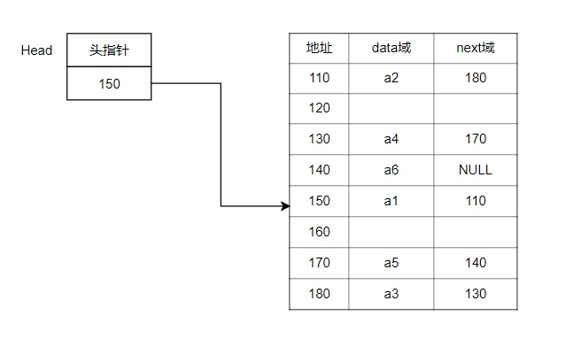

# 单链表

## 1、介绍

链表是有序的列表，在内存中的存储形式如下：




## 2、分析

1）链表是以节点的方式来存储，**链表存储**

2）每个节点包含data域，next 域:指向下一个节点

3）**链表的各个节点不一定是连续存储的**

4）链表分为**带头节点的链表**和**不带头节点的链表**，需要按实际情况来确定

带头节点的单链表逻辑示意图:


## 3、思路

一、添加

1）第一种添加节点的情况：**尾部追加**

- 先创建一个head头节点，作用就是表示单链表的头，不存放具体的数据
- 后面每添加一个新的节点，就直接加入到链表的最后

2）第二种添加节点的情况：**插入到指定位置**

- 首先找到新添加的节点的位置，是通过辅助变量（指针）遍历来搞定，需要按编号的顺序添加
- newNode.next = temp.next
- temp.next = newNode

二、修改

1）先找到该节点，通过遍历和地址号判断

2）赋值更新：temp.data = newNode.data

三、删除

1）先找到需要删除的这个节点的前一个节点

2）temp.next = temp.next.next

3）被删除的节点，将不会有其它的引用指向，会被垃圾回收机制回收

## 4、单链表代码

```java
/**
 * @description:单向链表
 * @author:mangxiao2018@126.com
 * @date:2021-7-3
 */
@Slf4j(topic = "c.SingleLinkedList")
public class SingleLinkedList {
    //初始化一个头节点，头节点不要动，不存放具体的数据
    private Node head = new Node(0, "");
    //得到头节点
    public Node getHead(){
        return head;
    }

    /**
     * 添加节点到单向链表
     * 思路，当不考虑编号顺序时
     * 1.找到当前链表的最后节点
     * 2.将最后这个节点的next 指向 新的节点
     * @param node
     */
    public void add(Node node){
        //因为head节点不能动，因些我们需要一个辅助遍历temp
        Node temp = head;
        //遍历链表，找到最后
        while(true){
            //找到链表的最后
            if (temp.next == null){
                break;
            }
            //如果没有找到最后，将temp后移
            temp = temp.next;
        }
        //当退出while循环时，temp就指向了链表的最后
        //将最后这个节点的next指向新的节点
        temp.next = node;
    }

    /**
     * 按大小顺序添加节点
     * 第二种方式在添加数据时，根据排名将数据插入到指定位置
     * 如果有这个排名，则添加失败，并给出提示
     * @param node
     */
    public void addByOrder(Node node){
        //因为头节点不能动，因此我们仍然通过一个辅助指针(变量)来帮助找到添加的位置
        //因为单链表，因为我们找的temp 是位于 添加位置的前一个节点，否则插入不了
        Node temp = head;
        //flag标志添加的编号是否存在，默认为false
        boolean flag = false;
        while(true){
            //说明temp已经在链表的最后
            if (temp.next == null){
                break;
            }
            //说明希望添加的node编号已然存在
            if (temp.next.no > node.no){
                flag = true;
            }
            //后移，遍历当前链表
            temp = temp.next;
        }
        //判断flag的值
        if (flag){
            log.debug("准备插入的编号%d已经存在了，不能再加入\n",node.no);
        }else{
            //插入到链表中，temp的后面
            node.next = temp.next;
            temp.next = node;
        }
    }

    /**
     * 更新指定节点
     * 修改节点的信息, 根据no编号来修改，即no编号不能改.
     * 说明
     * 1. 根据 newHeroNode 的 no 来修改即可
     * @param newNode
     */
    public void update(Node newNode){
        //判断是否为空
        if (head.next == null){
            log.debug("链表为空....");
            return;
        }

        //表示是否找到该节点
        boolean flag = false;
        //找到需要修改的节点，根据no编号
        //定义一个辅助变量
        Node temp = head.next;
        while (true){
            //已经遍历完链表
            if (temp == null){
                break;
            }
            if (temp.no == newNode.no){
                //找到
                flag = true;
                break;
            }
            temp = temp.next;
        }
        //根据flag判断是否找到要修改的节点
        if (flag){
            temp.data = newNode.data;
        }else{
            log.debug("没有找到编号%d的节点，不能修改\n",newNode.no);
        }
    }

    /**
     * 删除指定节点
     * 思路
     * 1. head 不能动，因此我们需要一个temp辅助节点找到待删除节点的前一个节点
     * 2. 说明我们在比较时，是temp.next.no 和  需要删除的节点的no比较
     * @param no
     */
    public void del(int no){
        Node temp = head;
        //标志是否找到待删除节点
        boolean flag = false;
        while (true){
            //已经到链表的最后
            if (temp == null){
                break;
            }
            if (temp.next.no == no){
                //找到的待删除节点的前一个节点temp
                flag = true;
                break;
            }
            //temp后移，遍历
            temp = temp.next;
        }
        //判断flag
        if (flag){
            //可以删除
            temp.next = temp.next.next;
        }else{
            log.debug("要删除的%d节点不存在\n",no);
        }
    }

    /**
     * 遍历显示列表
     * 判断链表是否为空
     */
    public void list(){
        //判断链表是否为空
        if (head.next == null){
            log.debug("链表为空");
            return;
        }
        //因为头节点，不能动，因些我们需要一个辅助变理来遍历
        Node temp = head.next;
        while (true){
            //判断是否到了链表的最后
            if (temp == null){
                break;
            }
            //输出节点的信息
            log.debug(temp.toString());
            //将temp后移,一定小心
            temp = temp.next;
        }
    }
}
```

