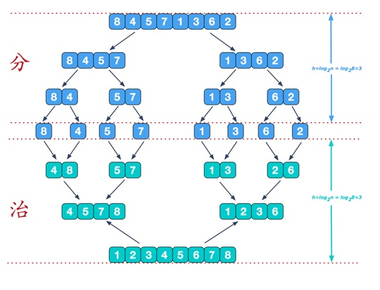
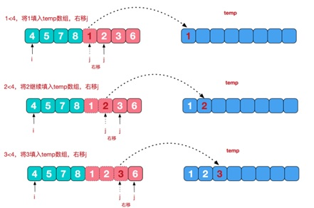
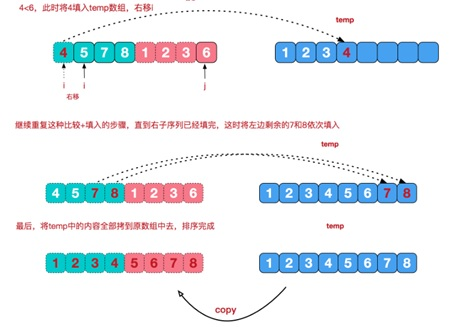

# 归并排序

## 1、介绍

归并排序（MERGE-SORT）是利用归并的思想实现的排序方法，该算法采用经典的分治（divide-and-conquer）策略（分治法将问题分(divide)成一些小的问题然后递归求解，而治(conquer)的阶段则将分的阶段得到的各答案"修补"在一起，即分而治之)。

## 2、思路

**思路-1-其中思想：**



>  说明：
>
> 可以看到这种结构很像一棵完全二叉树，本文的归并排序我们采用递归去实现（也可采用迭代的方式去实现）。分阶段可以理解为就是递归拆分子序列的过程

**思路-2-合并相邻有序子序列：**

再来看看治阶段，我们需要将两个已经有序的子序列合并成一个有序序列，比如上图中的最后一次合并，要将[4,5,7,8]和[1,2,3,6]两个已经有序的子序列，合并为最终序列[1,2,3,4,5,6,7,8]，来看下实现步骤






## 3、代码

给你一个数组, val arr = Array(9,8,7,6,5,4,3,2,1), 请使用归并排序完成排序。

```java
import lombok.extern.slf4j.Slf4j;

import java.text.SimpleDateFormat;
import java.util.Date;

/**
 * @description:归并排序
 * @author:mangxiao2018@126.com
 * @date:2021-8-7
 */
@Slf4j(topic = "c.MergeSort")
public class MergeSort {

    public static void main(String[] args) {
        //int arr[] = { 8, 4, 5, 7, 1, 3, 6, 2 }; //

        //测试快排的执行速度
        // 创建要给80000个的随机的数组
        int[] arr = new int[8000000];
        for (int i = 0; i < 8000000; i++) {
            arr[i] = (int) (Math.random() * 8000000); // 生成一个[0, 8000000) 数
        }
        log.debug("排序前");
        Date data1 = new Date();
        SimpleDateFormat simpleDateFormat = new SimpleDateFormat("yyyy-MM-dd HH:mm:ss");
        String date1Str = simpleDateFormat.format(data1);
        log.debug("排序前的时间是=" + date1Str);

        int temp[] = new int[arr.length]; //归并排序需要一个额外空间
        mergeSort(arr, 0, arr.length - 1, temp);

        Date data2 = new Date();
        String date2Str = simpleDateFormat.format(data2);
        log.debug("排序前的时间是=" + date2Str);

    }

    //分+合方法
    public static void mergeSort(int[] arr, int left, int right, int[] temp) {
        if(left < right) {
            int mid = (left + right) / 2; //中间索引
            //向左递归进行分解
            mergeSort(arr, left, mid, temp);
            //向右递归进行分解
            mergeSort(arr, mid + 1, right, temp);
            //合并
            merge(arr, left, mid, right, temp);
        }
    }

    //合并的方法
    /**
     *
     * @param arr 排序的原始数组
     * @param left 左边有序序列的初始索引
     * @param mid 中间索引
     * @param right 右边索引
     * @param temp 做中转的数组
     */
    public static void merge(int[] arr, int left, int mid, int right, int[] temp) {

        int i = left; // 初始化i, 左边有序序列的初始索引
        int j = mid + 1; //初始化j, 右边有序序列的初始索引
        int t = 0; // 指向temp数组的当前索引
        //(一)
        //先把左右两边(有序)的数据按照规则填充到temp数组
        //直到左右两边的有序序列，有一边处理完毕为止
        while (i <= mid && j <= right) {//继续
            //如果左边的有序序列的当前元素，小于等于右边有序序列的当前元素
            //即将左边的当前元素，填充到 temp数组
            //然后 t++, i++
            if(arr[i] <= arr[j]) {
                temp[t] = arr[i];
                t += 1;
                i += 1;
            } else { //反之,将右边有序序列的当前元素，填充到temp数组
                temp[t] = arr[j];
                t += 1;
                j += 1;
            }
        }
        //(二)
        //把有剩余数据的一边的数据依次全部填充到temp
        while( i <= mid) { //左边的有序序列还有剩余的元素，就全部填充到temp
            temp[t] = arr[i];
            t += 1;
            i += 1;
        }
        while( j <= right) { //右边的有序序列还有剩余的元素，就全部填充到temp
            temp[t] = arr[j];
            t += 1;
            j += 1;
        }
        //(三)
        //将temp数组的元素拷贝到arr
        //注意，并不是每次都拷贝所有
        t = 0;
        int tempLeft = left; //
        //第一次合并 tempLeft = 0 , right = 1 //  tempLeft = 2  right = 3 // tL=0 ri=3
        //最后一次 tempLeft = 0  right = 7
        while(tempLeft <= right) {
            arr[tempLeft] = temp[t];
            t += 1;
            tempLeft += 1;
        }

    }
}
```


