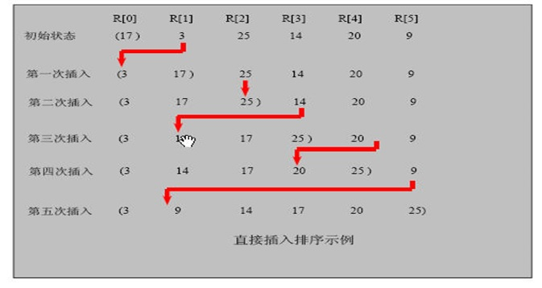

# 插入排序

## 1、介绍

插入排序是内部排序，对待排元素以插入的方式寻找该元素的适当位置，以达到排序的目的。

## 2、思路

插入排序（Insertion Sorting）的基本思想是：把n个待排序的元素看成为一个有序表和一个无序表，开始时有序表中只包含一个元素，无序表中包含有n-1个元素，排序过程中每次从无序表中取出第一个元素，把它的排序码依次与有序表元素的排序码进行比较，将它插入到有序表中的适当位置，使之成为新的有序表。



## 3、代码

```java
import lombok.extern.slf4j.Slf4j;

import java.text.SimpleDateFormat;
import java.util.Date;

/**
 * @description:插入排序
 * @author:mangxiao2018@126.com
 * @date:2021-8-4
 */
@Slf4j(topic = "c.InsertSort")
public class InsertSort {
    public static void main(String[] args) {
        //int[] arr = {101, 34, 119, 1, -1, 89};
        // 创建要给80000个的随机的数组
        int[] arr = new int[80000];
        for (int i = 0; i < 80000; i++) {
            arr[i] = (int) (Math.random() * 8000000); // 生成一个[0, 8000000) 数
        }

        log.debug("插入排序前");
        Date data1 = new Date();
        SimpleDateFormat simpleDateFormat = new SimpleDateFormat("yyyy-MM-dd HH:mm:ss");
        String date1Str = simpleDateFormat.format(data1);
        log.debug("排序前的时间是=" + date1Str);

        sort(arr); //调用插入排序算法

        Date data2 = new Date();
        String date2Str = simpleDateFormat.format(data2);
        log.debug("排序前的时间是=" + date2Str);

    }

    //插入排序
    public static void sort(int[] arr) {
        int insertVal = 0;
        int insertIndex = 0;
        //使用for循环来把代码简化
        for (int i = 1; i < arr.length; i++) {
            //定义待插入的数
            insertVal = arr[i];
            insertIndex = i - 1; // 即arr[1]的前面这个数的下标

            // 给insertVal 找到插入的位置
            // 说明
            // 1. insertIndex >= 0 保证在给insertVal 找插入位置，不越界
            // 2. insertVal < arr[insertIndex] 待插入的数，还没有找到插入位置
            // 3. 就需要将 arr[insertIndex] 后移
            while (insertIndex >= 0 && insertVal < arr[insertIndex]) {
                arr[insertIndex + 1] = arr[insertIndex];// arr[insertIndex]
                insertIndex--;
            }
            // 当退出while循环时，说明插入的位置找到, insertIndex + 1
            // 举例：理解不了，我们一会 debug
            //这里我们判断是否需要赋值
            if (insertIndex + 1 != i) {
                arr[insertIndex + 1] = insertVal;
            }

        }
    }

}
```

