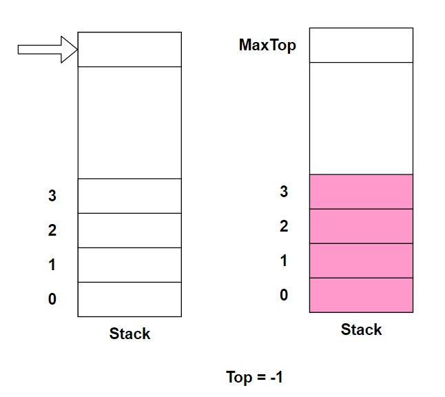

# 栈

## 1、介绍

- 栈是一个先入后出（FILO-First In Last Out）的有序列表。
- 栈是限制线性表中元素的插入和删除操作，只能在线性表的同一端进行的一种特殊线性表。允许插入和删除的一端，为变化的一端，称为栈顶(Top)，另一端为固定的一端，称为栈底(Bottom)。
- 根据栈的定义可知，最先放入栈中元素在栈底，最后放入的元素在栈顶，而删除元素刚好相反，最后放入的元素最先删除，最先放入的元素最后删除。
- 图解说明出栈（pop）和入栈(push)的概念


## 2、应用场景

- 子程序的调用：在跳往子程序前，会先将下个指令的地址存到椎栈中，直到子程序执行完后再将地址取出，以回到原来的程序中。
- 处理递归调用：和子程序的调用类似，只是除了储存下一个指令的地址外，也将参数、区载变量等数据存入堆栈中。
- 表达式的转换(中缀表达式转后缀表达式)与求值
- 二叉树的遍历
- 图形的深度优先(depth-first)搜索法

## 3、思路

由于栈是一种有序列表，而数组也是有序列表，所以可以用数组来模拟栈的实现。下面代码用数组来模拟入栈和出栈操作。



实现栈的思路分析：

1、使用数组来模拟栈

2、定义一个top来表示栈顶，初始值为-1

3、入栈的操作，当有数据加入到栈时，top ++; stack[top] = data;

4、出栈的操作，int value = stack[top]; top --; return value

## 4、代码

```java

/**
 * @description:数据栈
 * @author:mangxiao2018@126.com
 * @date:2021-4-4
 */
public class ArrayStack {
    private int maxSize;
    private int[] stack;
    private int top = -1;

    public ArrayStack(int maxSize){
        this.maxSize = maxSize;
        stack = new int[maxSize];
    }

    /**
     * 返回当前栈的值
     * @return
     */
    public int peek(){
        return stack[top];
    }

    public boolean isFull(){
        return top == maxSize - 1;
    }

    public boolean isEmpty(){
        return top == -1;
    }

    public void push(int value){
        if (isFull()){
            System.out.println("栈满");
            return;
        }
        top ++;
        stack[top] = value;
    }

    public int pop(){
        if (isEmpty()){
            throw new RuntimeException("栈空，没有数据");
        }
        int value = stack[top];
        top --;
        return value;
    }

    public void list(){
        if (isEmpty()){
            System.out.println("栈空没有数据");
            return;
        }
        for (int i=top; i>= 0; i--){
            System.out.printf("stack[%d]=%d\n",i, stack[i]);
        }
    }

    /**
     * 返回运算符的优先级，使用数字表示
     * 数字越大，则优先级越高
     * @param oper
     * @return
     */
    public int priority(int oper){
        if (oper == '*' || oper == '/'){
            return 1;
        } else if (oper == '+' || oper == '-'){
            return 0;
        }else{
            return -1;
        }
    }

    /**
     * 判断是不是一个运算符
     * @param val
     * @return
     */
    public boolean isOper(char val){
        return val == '+' || val == '-' || val == '*' || val == '/';
    }

    /**
     * 计算方法
     * @param num1
     * @param num2
     * @param oper
     * @return
     */
    public int cal(int num1, int num2, int oper){
        int res = 0;
        switch (oper){
            case '+':
                res = num1 + num2;
                break;
            case '-':
                res = num2 - num1;
                break;
            case '*':
                res = num1 * num2;
                break;
            case '/':
                res = num2 / num1;
                break;
            default:
                break;
        }
        return res;
    }
}
```


