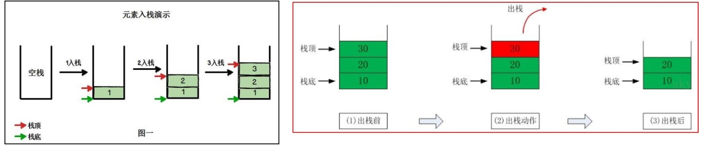

# 栈

## 1、介绍

- 栈是一个先入后出（FILO-First In Last Out）的有序列表。
- 栈是限制线性表中元素的插入和删除操作，只能在线性表的同一端进行的一种特殊线性表。允许插入和删除的一端，为变化的一端，称为栈顶(Top)，另一端为固定的一端，称为栈底(Bottom)。
- 根据栈的定义可知，最先放入栈中元素在栈底，最后放入的元素在栈顶，而删除元素刚好相反，最后放入的元素最先删除，最先放入的元素最后删除。
- 图解说明出栈（pop）和入栈(push)的概念

## 2、应用场景

- 子程序的调用：在跳往子程序前，会先将下个指令的地址存到椎栈中，直到子程序执行完后再将地址取出，以回到原来的程序中。
- 处理递归调用：和子程序的调用类似，只是除了储存下一个指令的地址外，也将参数、区载变量等数据存入堆栈中。
- 表达式的转换(中缀表达式转后缀表达式)与求值
- 二叉树的遍历
- 图形的深度优先(depth-first)搜索法

## 3、思路

## 4、代码

