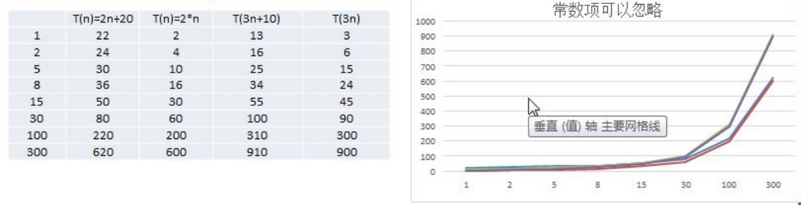
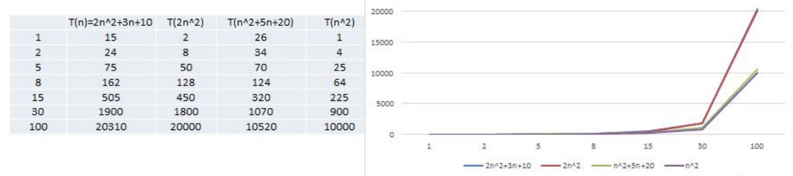
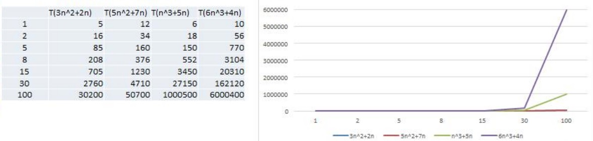
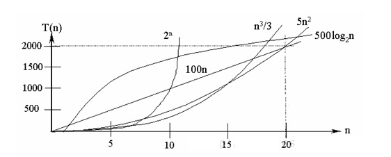

# 算法时间复杂度

## 1、估算程序测试时间的方法

### 1、事后统计法

该方法需要：

1.实际运行程序，看执行时间，

2.程序运行在不同的硬件机器上结果不同

### 2、事前估算法

通过分析某个算法的**时间复杂度**来判断哪个算法更优

## 2、时间频度

一个算法中花费的时间与算法中语句的执行次数成正比例，哪个算法中语句的执行次数多，它花费的时间就多。一个算法中语句的执行次数称为语句频度或时间频度，记作T(n)

举例：1-100所有整数之和，下面是两种算法:

```java
int total = 0;
int end = 100;	
for(int i = 1;i <= end; i++){
    total + = i;
}
```

T(n) = n + 1

```java
total = (1 + end) * end /2;
```

T(n) = 1	

#### 1、忽略常数项



结论：

1）2n + 20 和2n 随着n变大，执行曲线无限接近，20可以忽略

2）3n + 10 和3n 随着n变大，执行曲线无限接近，10可以忽略

#### 2、忽略低次项



结论：

1）2n^2 + 3n + 10 和2n^2 随着n变大，执行曲线无限接近，可以忽略3n + 10

2）n^2 + 5n + 20和n^2 随着n变大，执行曲线无限接近，可以忽略5n + 20

#### 3、忽略系数



结论：

1）随着n变大，5n^2 + 7n 和3n^2 + 2n ，执行曲线重合，说明可以忽略5和3

2）而n^3 + 5n 和6n^3 + 4n， 随着n变大，执行曲线分离，说明多少次方关键。

## 3、时间复杂度计算方法

1）用常数1代替运行时间中的所有加法常数  T(n)=n²+7n+6  => T(n)=n²+7n+1

2）修改后的运行次数函数中，只保留最高阶项  T(n)=n²+7n+1 => T(n) = n²

3）去除最高阶项的系数 T(n) = n² => T(n) = n² => O(n²)

## 4、常见时间复杂度

1）常数阶O(1)

2）对数阶O(log2n)

3）线性阶O(n)

4）线性对数阶O(nlog2n)

5）平方阶O(n^2)

6）立方阶O(n^3)

7）k次方阶O(n^k)

8）指数阶O(2^n)



说明：

1) 常见的算法时间复杂度由小到大依次为：Ο(1)＜Ο(log2^n)＜Ο(n)＜Ο(nlog2^n)＜Ο(n^2)＜Ο(n^3)＜ Ο(n^k) ＜Ο(2^n)，随着问题规模n的不断增大，上述时间复杂度不断增大，算法的执行效率越低

2) 从图中可见，我们应该尽可能避免使用指数阶的算法


## 5、常见时间复杂度代码实现	

1）常数阶O(1)

无论代码执行了多少行，只要是没有循环等复杂结构，那这个代码的时间复杂度就都是O(1)

```java
int i = 1;
int j = 2;
++i;
j++;
int m = i + j;
```

上述代码在执行的时候，它消耗的时候并不随着某个变量的增长而增长，那么无论这类代码有多长，即使有几万几十万行，都可以用O(1)来表示它的时间复杂度。

2）对数阶O($ log_2n $)

```java
int i = 1;
while(i < n){
    i = i * 2;
}
```

**说明**：在while循环里面，每次都将 i 乘以 2，乘完之后，i 距离 n 就越来越近了。假设循环x次之后，i 就大于 2 了，此时这个循环就退出了，也就是说 2 的 x 次方等于 n，那么 x = $ log_2n $也就是说当循环 次$ log_2n $以后，这个代码就结束了。因此这个代码的时间复杂度为：O($ log_2n $) 。 O(**$ log_2n $) 的这个2 时间上是根据代码变化的，i = i * 3 ，则是 O(**$ log_3n $)

3）线性阶O(n)

```java
for(int i = 1; i <= n; ++i){
    j = i;
    j++;
}
```

**说明**：这段代码，for循环里面的代码会执行n遍，因此它消耗的时间是随着n的变化而变化的，因此这类代码都可以用O(n)来表示它的时间复杂度

4）线性对数阶O(nlogN)

```java
for(int m = 1; m < n; m++){
    i = 1;
    while(i < n){
        i = i * 2;
    }
}
```

**说明**：线性对数阶O(nlogN) 其实非常容易理解，将时间复杂度为O(logn)的代码循环N遍的话，那么它的时间复杂度就是 n * O(logN)，也就是了O(nlogN)

5）平方阶O(n²)

```java
for(int x = 1; x <= n; x ++){
    for(int i = 1; i <= n;i++){
        j = i;
        j++;
    }
}
```

**说明**：平方阶O(n²) 就更容易理解了，如果把 O(n) 的代码再嵌套循环一遍，它的时间复杂度就是 O(n²)，这段代码其实就是嵌套了2层n循环，它的时间复杂度就是 O(n*n)，即 O(n²) 如果将其中一层循环的n改成m，那它的时间复杂度就变成了 O(m*n)

6）立方阶O(n³)、K次方阶O(n^k)

**说明**：参考上面的O(n²) 去理解就好了，O(n³)相当于三层n循环，其它的类似

## 6、平均时间复杂度和最坏时间复杂度

1）平均时间复杂度是指所有可能的输入实例均以等概率出现的情况下，该算法的运行时间。

2）最坏情况下的时间复杂度称最坏时间复杂度。一般讨论的时间复杂度均是最坏情况下的时间复杂度。 这样做的原因是：最坏情况下的时间复杂度是算法在任何输入实例上运行时间的界限，这就保证了算法的运行时间不会比最坏情况更长。

3）平均时间复杂度和最坏时间复杂度是否一致，和算法有关

| 排度序法 | 平均时间复杂度 |   最差时间复杂度   | 稳定度 |    额外空间    | 备注                        |
| :------: | :------------: | :----------------: | :----: | :------------: | --------------------------- |
|   冒泡   |   O($ n^2 $)   |     O($ n^2 $)     |  稳定  |      O(1)      | n小时较好                   |
|   交换   |   O($ n^2 $)   |     O($ n^2 $)     | 不稳定 |      O(1)      | n小时较好                   |
|   选择   |   O($ n^2 $)   |     O($ n^2 $)     | 不稳定 |      O(1)      | n小时较好                   |
|   插入   |   O($ n^2 $)   |     O($ n^2 $)     |  稳定  |      O(1)      | 大部分已排序时较好          |
|   基数   | O($ log_RB $)  |   O($ log_RB $)    |  稳定  |      O(n)      | B是真数(0-9)R是基数(个十百) |
|  shell   | O($ nlog_2n $) | O($ n^s $) [1<s<2] | 不稳定 |      O(1)      | s是所选分组                 |
|   快速   | O($ nlog_2n $) |     O($ n^2 $)     | 不稳定 | O($ nlog_2n $) | n大时较好                   |
|   归并   | O($ nlog_2n $) |   O($ nlog_2n $)   |  稳定  |      O(1)      | n大时较好                   |
|    堆    | O($ nlog_2n $) |   O($ nlog_2n $)   | 不稳定 |      O(1)      | n大时较好                   |

## 7、空间复杂度

（略）随意硬件成本的降低和硬件的飞速发展，空间不是主要矛盾，不再重点关注。

## 8、对数知识

对于时间复杂度logn有的没有底数，有的给出以2为底，这个网查了一下，给出的解释是看使用的是二分法还是几分法，如用2分法就是以2为底（这个我到时再验证一下，到时再交流）。另外从数学角度看对数ln是以e为底的，lg通常是以10为底的，数字10常常省略写出来，自然对数是以e为底，常用对数通常指的是以10为底的对数。
