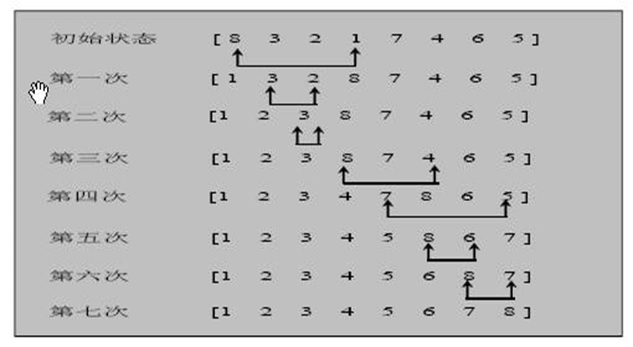

# 选择排序

## 1、介绍

选择式排序属于内部排序算法，在待排数据中，按指定规则选出某一元素，再依规定交换位置，达到排序的目的。

## 2、分析

选择排序（select sorting）也是一种简单的排序方法。它的基本思想是：第一次从arr[0]~arr[n-1]中选取最小值，与arr[0]交换，第二次从arr[1]~arr[n-1]中选取最小值，与arr[1]交换，第三次从arr[2]~arr[n-1]中选取最小值，与arr[2]交换，…，第i次从arr[i-1]~arr[n-1]中选取最小值，与arr[i-1]交换，…, 第n-1次从arr[n-2]~arr[n-1]中选取最小值，与arr[n-2]交换，总共通过n-1次，得到一个按排序码从小到大排列的有序序列。



## 3、思路


原始的数组 ： 101, 34, 119, 1

第一轮排序 :  **1**, 34, 119, 101

第二轮排序 :  **1**, 34, 119, 101

第三轮排序 :  1, 34, 101, 119


说明：

1. 选择排序一共有 数组大小 - 1 轮排序

2. 每1轮排序，又是一个循环, 循环的规则(代码)

   2.1先假定当前这个数是最小数

   2.2 然后和后面的每个数进行比较，如果发现有比当前数更小的数，就重新确定最小数，并得到下标

   2.3 当遍历到数组的最后时，就得到本轮最小数和下标

   2.4 交换 [代码中再继续说 ]

## 4、代码

```java
import lombok.extern.slf4j.Slf4j;

import java.text.SimpleDateFormat;
import java.util.Arrays;
import java.util.Date;

/**
 * @description:选择排序
 * @author:mangxiao2018@126.com
 * @date:2021-8-3
 */
@Slf4j(topic = "c.SelectSort")
public class SelectSort {

    public static void main(String[] args){
        //int [] arr = {101, 34, 119, 1, -1, 90, 123};

        //创建要给80000个的随机的数组
        int[] arr = new int[80000];
        for (int i = 0; i < 80000; i++) {
            arr[i] = (int) (Math.random() * 8000000); // 生成一个[0, 8000000) 数
        }

        log.debug("排序前");

        Date data1 = new Date();
        SimpleDateFormat simpleDateFormat = new SimpleDateFormat("yyyy-MM-dd HH:mm:ss");
        String date1Str = simpleDateFormat.format(data1);
        log.debug("排序前的时间是=" + date1Str);

        sort(arr);

        Date data2 = new Date();
        String date2Str = simpleDateFormat.format(data2);
        log.debug("排序前的时间是=" + date2Str);

    }
    /**
     * 选择排序
     * @param arr
     */
    public static void sort(int[] arr){
        //在推导的过程，我们发现了规律，因此，可以使用for来解决
        //选择排序时间复杂度是 O(n^2)
        for(int i = 0; i < arr.length - 1; i++){
            int minIndex = i;
            int min = arr[i];
            for (int j = i + 1; j < arr.length; j++){
                // 说明假定的最小值，并不是最小
                if (min > arr[j]){
                    min = arr[j];// 重置min
                    minIndex = j;// 重置minIndex
                }
            }
            // 将最小值，放在arr[0], 即交换
            if (minIndex != i){
                arr[minIndex] = arr[i];
                arr[i] = min;
            }
        }

        //使用逐步推导的方式来，讲解选择排序
        //第1轮
        //原始的数组 ： 	101, 34, 119, 1
        //第一轮排序 :   	1, 34, 119, 101
        //算法 先简单--》 做复杂， 就是可以把一个复杂的算法，拆分成简单的问题-》逐步解决

        //第1轮
        int minIndex = 0;
        int min = arr[0];
        for (int j = 0 + 1; j < arr.length; j++){
            if (min > arr[j]){
                min = arr[j];
                minIndex = j;
            }
        }
        //将最小值，放在arr[0], 即交换
        if (minIndex != 0){
            arr[minIndex] = arr[0];
            arr[0] = min;
        }
        log.debug("第1轮后...");
        log.debug(Arrays.toString(arr));

        //第2轮
        minIndex = 1;
        min = arr[1];
        for (int j = 1 +1; j < arr.length; j++){
            if (min > arr[j]){
                min = arr[j];
                minIndex = j;
            }
        }
        // 将最小值，放在arr[0], 即交换
        if (minIndex != 1){
            arr[minIndex] = arr[1];
            arr[1] = min;
        }
        log.debug("第2轮后...");
        log.debug(Arrays.toString(arr));
        //第3轮
        minIndex = 2;
        min = arr[2];
        for (int j = 2 + 1; j < arr.length; j++){
            if (min > arr[j]){
                min = arr[j];
                minIndex = j;
            }
        }
        // 将最小值，放在arr[0], 即交换
        if (minIndex != 2){
            arr[minIndex] = arr[2];
            arr[2] = min;
        }
        log.debug("第3轮后...");
        log.debug(Arrays.toString(arr));
    }
}
```


