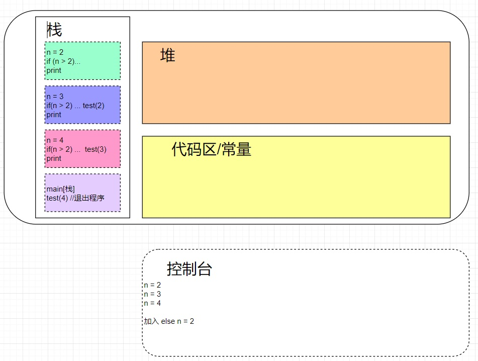

# 递归

## 1、概念

递归就是方法自己调用自己，每次调用时传入不同的变量

## 2、应用场景

- 问题回溯
- 递归

## 3、原理

```java
import lombok.extern.slf4j.Slf4j;

/**
 * @description:递归例子
 * @author:mangxiao2018@126.com
 * @date:2021-6-10
 */
@Slf4j(topic = "c.TestRecursion")
public class TestRecursion {
    public static void main(String[] args){
        print(3);
        log.debug("x = " + x);
    }

    /**
     * 自然数打印
     * @param n
     */
    public static void print(int n){
        if(n < 2){
            log.debug("n = " + n);
        }else {
            print(n - 1);
            log.debug("n = " + n);
        }
    }
}
```

> 递归调用规则：
>
> 1. 当程序执行到一个方法时，就会开辟一个独立的空间（栈）
> 2. 每个空间的数据（局部变量），是独立的



## 4、递归解决的问题

1. 各种数学问题，如：8皇后问题，汉诺塔，阶乘问题，迷宫问题，球和篮子的问题
2. 各种算法中也会用到递归，如快排，归并排序，二分查找，分治算法等
3. 将用栈解决的问题，也能用递归来解决，且代码更简洁

## 5、递归重要规则

1. 执行一个方法时，就创建一个新的受保护的独立空间(栈空间)
2. 方法的局部变量是独立的，不会相互影响, 比如n变量
3. 如果方法中使用的是引用类型变量(比如数组)，就会共享该引用类型的数据.
4. 递归必须向退出递归的条件逼近，否则就是无限递归,出现StackOverflowError
5. 当一个方法执行完毕，或者遇到return，就会返回，遵守谁调用，就将结果返回给谁，同时当方法执行完毕或者返回时，该方法也就执行完毕。

## 6、迷宫代码

> 说明:
>
> 1. 小球得到的路径，和程序员设置的找路策略有关即：找路的上下左右的顺序相关
> 2. 再得到小球路径时，可以先使用(下右上左)，再改成(上右下左)，看看路径是不是有变化 
> 3. 测试回溯现象
> 4. 思考: 如何求出最短路径

```java
import lombok.extern.slf4j.Slf4j;

/**
 * @description:迷宫游戏算法实例
 * @author:mangxiao
 * @2021-06-17
 */
@Slf4j(topic = "c.MiGong")
public class MiGong {

    public static void main(String[] args){
        //创建一个二维数组，模拟迷宫
        //墙
        int[][] map = new int[8][7];
        //使用1表示墙
        //上下全部设置为1
        for (int i = 0; i < 7; i++){
            map[0][i] = 1;
            map[7][i] = 1;
        }
        //左右全部设置为1
        for (int i = 0; i < 8; i++){
            map[i][0] = 1;
            map[i][6] = 1;
        }
        //设置挡板
        map[3][1] = 1;
        map[3][2] = 1;
//        map[1][2] = 1;
        map[2][2] = 1;

        log.debug("地图的情况:");
        for (int i = 0; i < 8; i++){
            for (int j = 0; j < 7; j++){
                System.out.print(map[i][j] + " ");
            }
            System.out.println();
        }

        //使用递归回溯给小球找路
        setWay(map, 1, 1);
        //输出新的地图，小球走过，并标识过的递归
        System.out.println("小球走过，并标识过的地图情况:");
        for (int i = 0; i < 8; i++){
            for (int j = 0; j < 7; j++){
                System.out.print(map[i][j] + " ");
            }
            System.out.println();
        }
    }

    /**
     * 第一种行走方式:下->右->上->左
     * @param map
     * @param i
     * @param j
     * @return
     */
    public static boolean setWay(int[][] map, int i, int j){
        // 路已找到
        if (map[6][5] == 2){
            return true;
        }else{
            //按照策略：下->右->上->左走
            if (map[i][j] == 0){
                //假设该点可以走通
                map[i][j] = 2;
                if (setWay(map, i + 1, j)){
                    return true;
                }else if(setWay(map, i, j + 1)){
                    return true;
                }else if(setWay(map, i - 1, j)){
                    return true;
                }else if(setWay(map, i, j - 1)){
                    return true;
                }else{
                    map[i][j] = 3;
                    return false;
                }
            }else{
                return false;
            }
        }
    }

    /**
     *  第二种行走方式:上->右->下->左
     * @param map
     * @param i
     * @param j
     * @return
     */
    public static boolean setWay2(int[][] map, int i, int j){
        if (map[6][5] == 2){
            return true;
        }else {
            if (map[i][j] == 0){
                map[i][j] = 2;
                if (setWay2(map, i - 1, j)){
                    return true;
                }else if (setWay2(map, i, j + 1)){
                    return true;
                }else if (setWay2(map, i + 1, j)){
                    return true;
                }else if (setWay2(map, i, j - 1)){
                    return true;
                }else{
                    map[i][j] = 3;
                    return false;
                }
            }else {
                return false;
            }
        }
    }
}
```


